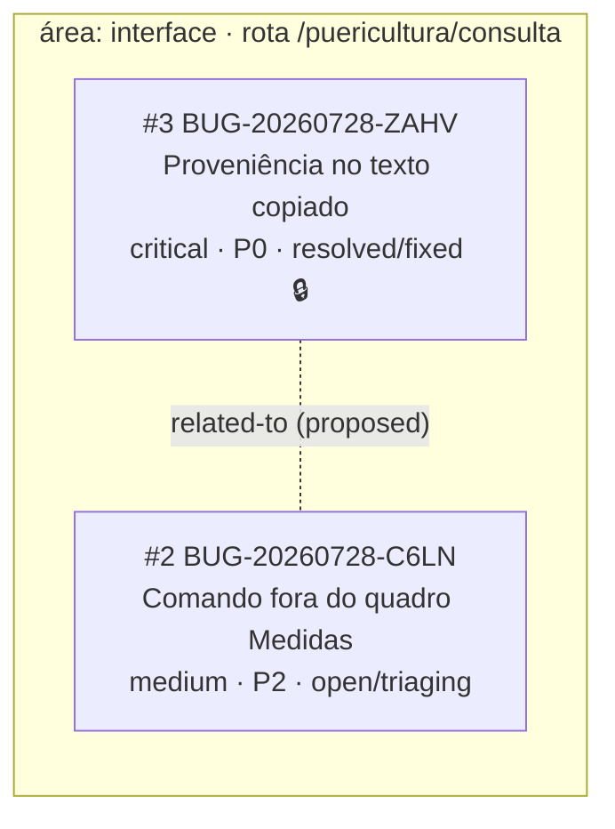

<!-- GENERATED, DO NOT EDIT: regenerado por /reversa-debugger-fix em 2026-07-28T22:30:00Z a partir de 2 bugs -->

# Grafo de bugs — contexto `consulta-puericultura`

## Clusters

Um cluster, por convergência de componente: `interface/puericultura/consulta/`. Dentro dele, os
arquivos afetados não se sobrepõem, de modo que as duas correções podiam correr em paralelo sem
conflito de edição — e a do ZAHV, aplicada em 28/07, não tocou nenhum arquivo do C6LN.

## Impact score

| Bug | Score | Decomposição |
|---|---|---|
| BUG-20260728-ZAHV | 0 | 0 causados, 0 bloqueados, 0 regressões, 1 relacionado **`proposed`** (não pontua) |
| BUG-20260728-C6LN | 0 | idem |

> Heurística de triagem (`causados*3 + bloqueados*2 + regressões*4 + relacionados*1`, só arestas
> `supported`/`confirmed`, `related-to` limitado a 3): não substitui priority/severity. Aqui os dois
> escores nulos não dizem nada sobre urgência — a ordem de tratamento veio de P0 antes de P2.

## Ordem de tratamento

1. ~~**BUG-20260728-ZAHV** (P0)~~ — **corrigido e travado em 2026-07-28**. `resolution_kind: fixed`,
   veredito `spec-desatualizada` com o adendo `bug-BUG-20260728-ZAHV-v001.md` sobre `contracts.md`.
   Pasta somente leitura.
2. **BUG-20260728-C6LN** (P2): correção de apresentação, com regra nova a escrever na spec da unit
   `interface-puericultura-consulta`, hoje omissa quanto à posição do gatilho. Segue aberto e
   desbloqueado; a correção do ZAHV não alterou nenhum dos arquivos que ele alcança
   (`app.tsx`, `ficha.tsx`, `consulta-puericultura.css`).
