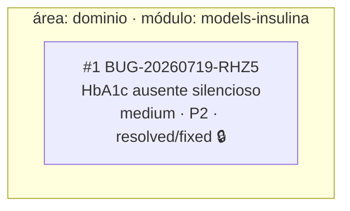

# Grafo de bugs — contexto `motor-insulina`

> View gerada em 2026-07-19 (atualizada no fechamento do BUG-20260719-RHZ5). NÃO editar à mão.

Impact score: n/a (bug único, sem arestas; relações `proposed` não pontuam).
