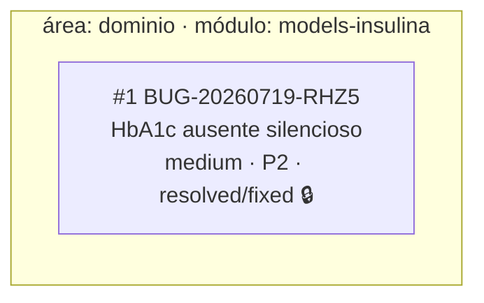

<!-- GENERATED, DO NOT EDIT: regenerado por /reversa-debugger-graph em 2026-07-19T23:08:14Z a partir de 1 bug -->

# Grafo de bugs — contexto `motor-insulina`

## Clusters

Nenhum: bug único, sem convergência de componente ou cadeia de specs a apontar.

## Impact score

| Bug | Score | Decomposição |
|---|---|---|
| — | — | Nenhum bug aberto a pontuar. |

> Heurística de triagem (`causados*3 + bloqueados*2 + regressões*4 + relacionados*1`, só arestas
> `supported`/`confirmed`, `related-to` limitado a 3): não substitui priority/severity.
