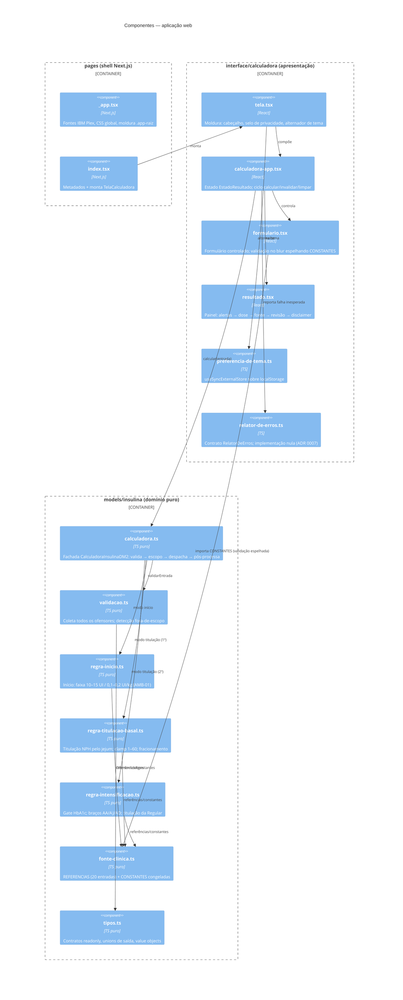

# C4 — Nível 3: Componentes — aps-inteligente

> Gerado pelo Reversa Architect em 2026-07-19.
> Escala de confiança: 🟢 CONFIRMADO · 🟡 INFERIDO · 🔴 LACUNA

🟢 Detalhamento do único container real (aplicação web), nas três camadas com dependência unidirecional (ADR 0003): `pages → interface → models`. O domínio não importa nada de framework.

## Responsabilidades e padrões

| Componente | Padrão | Nota |
|---|---|---|
| `calculadora.ts` | Facade | Pipeline: validação → escopo → Peso → despacho por modo → pós-processamento (alertas ordenados, dedupe) |
| `regra-*.ts` | Strategy informal | Compõem sobre o estado de trabalho `AjusteEmCurso` |
| `tipos.ts` | Value Objects + Result type | `Peso`, `Glicemia`, `DoseUi` congelados; `SaidaCalculo` como union |
| `relator-de-erros.ts` | Porta e adaptador | Única implementação nula; troca futura sem tocar UI/motor |
| `preferencia-de-tema.ts` | External store | Único efeito colateral persistente da aplicação |

## Pontos de atenção estruturais

- 🟡 `formulario.tsx` (532 LOC) concentra formulário, linhas dinâmicas e validação — candidato a extração de subcomponentes.
- 🟡 `let proximoId` módulo-global em `formulario.tsx` — frágil sob HMR/StrictMode.
- 🔴 A fronteira `interface → models` (unidirecional) não tem verificação automática: a regra de lint D-01 do repo antigo não foi reconstituída.
