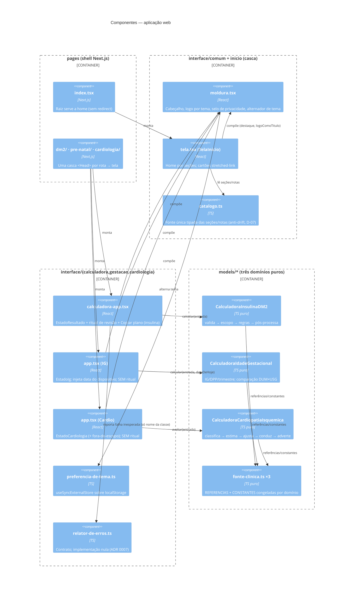
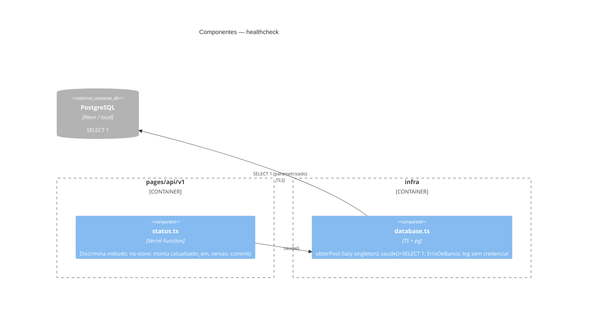

# C4 — Nível 3: Componentes — aps-inteligente

> Regenerado pelo Reversa Architect em 2026-07-23 (re-extração nº 2).
> Escala de confiança: 🟢 CONFIRMADO · 🟡 INFERIDO · 🔴 LACUNA

🟢 Dois recortes: a **aplicação web** (home → três telas → três domínios puros, sobre a `Moldura` comum) e a **fatia de observabilidade** (Function → infra → banco). As três camadas mantêm dependência unidirecional `pages → interface → models` (ADR 0003); o domínio não importa framework.

## Recorte 1 — Aplicação web (home, telas e domínios)

## Recorte 2 — Observabilidade (Function → infra → banco)

## Responsabilidades e padrões

| Componente | Padrão | Nota |
|---|---|---|
| `CalculadoraInsulinaDM2` | Facade + Strategy informal | Pipeline validação → escopo → `Peso` → despacho por modo → pós (alertas ordenados, dedupe) |
| `CalculadoraIdadeGestacional` | Facade | Datas em dias epoch UTC (ADR 0013); veredito de comparação, não escolha |
| `CalculadoraCardiopatiaIsquemica` | Facade | Cascata classificar→estimar→ajustar→conduzir; matriz congelada de 24 células |
| `Moldura` | Composite / casca comum | Props opcionais acumuladas por feature (`apresentacao`, `logoComoTitulo`) |
| `catalogo.ts` | Registro tipado | Toda calculadora nova entra aqui primeiro (anti-drift) |
| `preferencia-de-tema.ts` | External store | Único efeito colateral persistente da aplicação |
| `relator-de-erros.ts` | Porta e adaptador | Implementação nula; troca futura sem tocar UI/motor |
| `database.ts` | Adaptador de infraestrutura | Único ponto de acesso ao banco; erro como valor (`ErroDeBanco`) |

## Pontos de atenção estruturais

- 🟡 `interface/comum` importa `preferencia-de-tema.ts` de `interface/calculadora` — acoplamento residual declarado no código, realocação adiada.
- 🟡 `let proximoId` módulo-global em `formulario.tsx` da insulina — frágil sob HMR/StrictMode, funcional.
- 🟡 A fronteira `interface → models` (unidirecional) não tem verificação automática de lint (D-01); hoje respeitada por disciplina e revisão.
