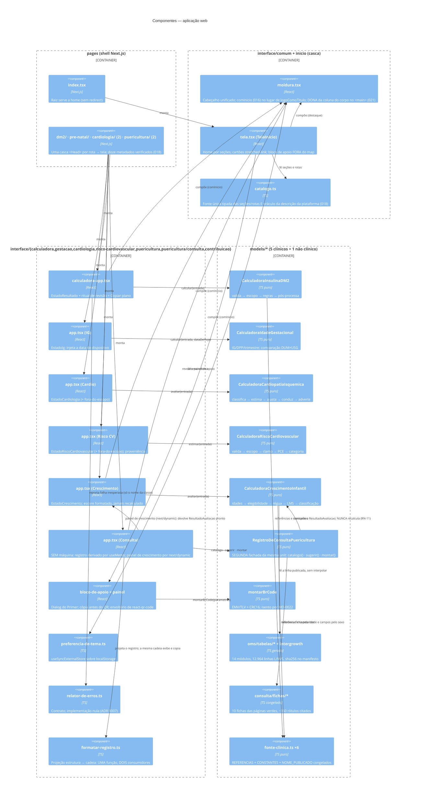
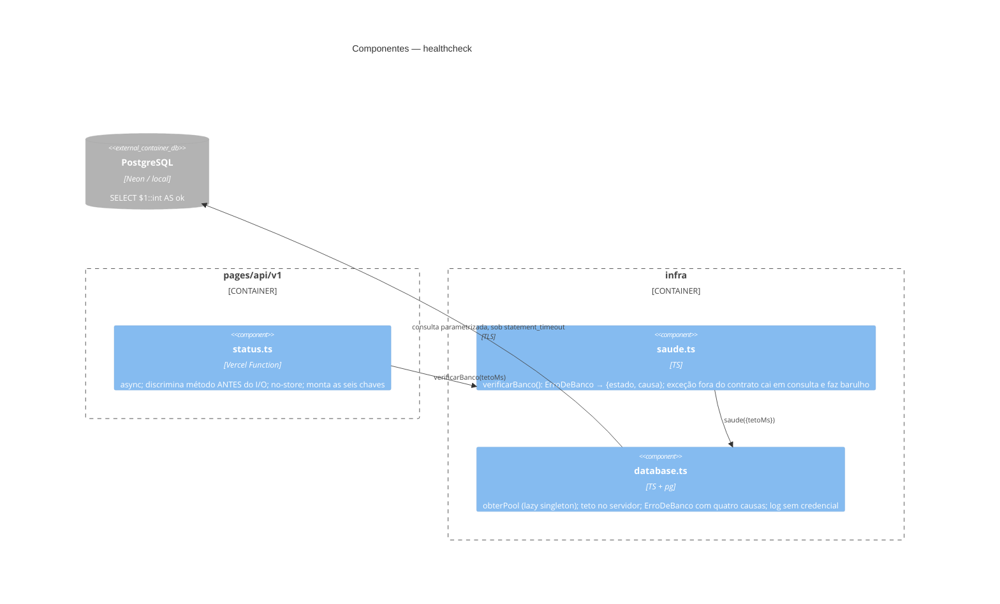
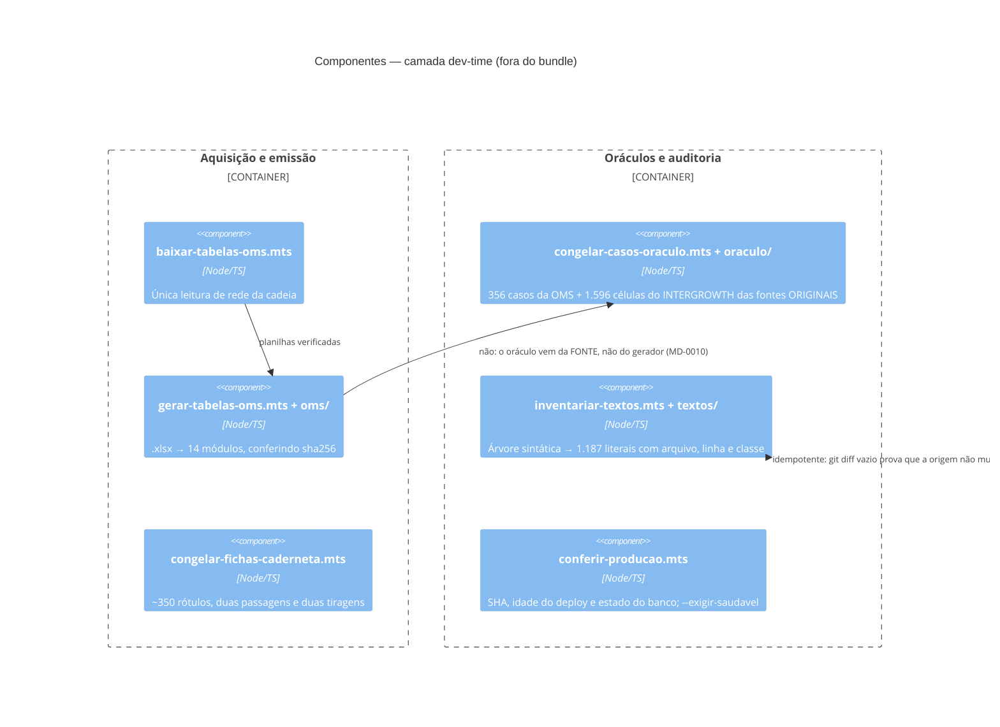

# C4 — Nível 3: Componentes — aps-inteligente

> Regenerado pelo Reversa Architect em 2026-07-28 (re-extração nº 4).
> Escala de confiança: 🟢 CONFIRMADO · 🟡 INFERIDO · 🔴 LACUNA

🟢 Três recortes: a **aplicação web** (home → seis telas → seis units), a **fatia de observabilidade** (Function → adaptador → banco → PostgreSQL) e a **camada dev-time**, que a extração anterior não conhecia. A dependência entre as camadas de aplicação segue unidirecional `pages → interface → models` (ADR 0003), e o domínio não importa framework.

## Recorte 1 — Aplicação web (home, telas e units)

```mermaid
C4Component
    title Componentes — aplicação web

    Container_Boundary(pages, "pages (shell Next.js)") {
        Component(index, "index.tsx", "Next.js", "Raiz serve a home (sem redirect)")
        Component(rotas, "dm2/ · pre-natal/ · cardiologia/ (2) · puericultura/ (2)", "Next.js", "Uma casca <Head> por rota → tela; doze metadados verificados (018)")
    }

    Container_Boundary(comum, "interface/comum + inicio (casca)") {
        Component(moldura, "moldura.tsx", "React", "Cabeçalho unificado; comInicio (016) no lugar de logoComoTitulo; DONA da coluna do corpo no <main> (021)")
        Component(home, "tela.tsx (TelaInicio)", "React", "Home por seções; cartões stretched-link; bloco de apoio FORA do map")
        Component(catalogo, "catalogo.ts", "TS", "Fonte única tipada das seções/rotas E oráculo da descrição da plataforma (018)")
    }

    Container_Boundary(telas, "interface/{calculadora,gestacao,cardiologia,risco-cardiovascular,puericultura,puericultura/consulta,contribuicao}") {
        Component(appIns, "calculadora-app.tsx", "React", "EstadoResultado + ritual de revisão + Copiar plano")
        Component(appGes, "app.tsx (IG)", "React", "EstadoIg; injeta a data do dispositivo")
        Component(appCar, "app.tsx (Cardio)", "React", "EstadoCardiologia (+ fora-do-escopo)")
        Component(appRcv, "app.tsx (Risco CV)", "React", "EstadoRiscoCardiovascular (+ fora-do-escopo); proveniência")
        Component(appPue, "app.tsx (Crescimento)", "React", "EstadoCrescimento; escore formatado, jamais recalculado")
        Component(appCns, "app.tsx (Consulta)", "React", "SEM máquina: registro derivado por useMemo; painel de crescimento por next/dynamic")
        Component(appPix, "bloco-de-apoio + painel", "React", "Dialog do Primer; cópia antes do QR; envoltório de react-qr-code")
        Component(tema, "preferencia-de-tema.ts", "TS", "useSyncExternalStore sobre localStorage")
        Component(rel, "relator-de-erros.ts", "TS", "Contrato; implementação nula (ADR 0007)")
        Component(fmt, "formatar-registro.ts", "TS", "Projeção estrutura → cadeia: UMA função, DOIS consumidores")
    }

    Container_Boundary(dom, "models/* (5 clínicos + 1 não clínico)") {
        Component(facIns, "CalculadoraInsulinaDM2", "TS puro", "valida → escopo → regras → pós-processa")
        Component(facGes, "CalculadoraIdadeGestacional", "TS puro", "IG/DPP/trimestre; comparação DUM×USG")
        Component(facCar, "CalculadoraCardiopatiaIsquemica", "TS puro", "classifica → estima → ajusta → conduz → adverte")
        Component(facRcv, "CalculadoraRiscoCardiovascular", "TS puro", "valida → escopo → clamp → PCE → categoria")
        Component(facPue, "CalculadoraCrescimentoInfantil", "TS puro", "idades → elegibilidade → régua → LMS → classificação")
        Component(facCns, "RegistroDeConsultaPuericultura", "TS puro", "SEGUNDA fachada da mesma unit: catalogo() · sugerir() · montar()")
        Component(facPix, "montarBrCode", "TS puro", "EMV/TLV + CRC16; isento por MD-0022")
        Component(tabelas, "oms/tabelas/* + intergrowth", "TS gerado", "14 módulos, 12.964 linhas L/M/S, sha256 no manifesto")
        Component(fichas, "consulta/fichas/*", "TS congelado", "10 fichas das páginas verdes, ~350 rótulos citados")
        Component(fontes, "fonte-clinica.ts ×6", "TS puro", "REFERENCIAS + CONSTANTES + NOME_PUBLICADO congelados")
    }

    Rel(index, home, "monta")
    Rel(rotas, appIns, "monta")
    Rel(rotas, appGes, "monta")
    Rel(rotas, appCar, "monta")
    Rel(rotas, appRcv, "monta")
    Rel(rotas, appPue, "monta")
    Rel(rotas, appCns, "monta")
    Rel(home, moldura, "compõe (destaque)")
    Rel(home, catalogo, "lê seções e rotas")
    Rel(home, appPix, "revela o painel de apoio")
    Rel(appIns, moldura, "compõe (comInicio)")
    Rel(appPue, moldura, "compõe (comInicio)")
    Rel(appCns, moldura, "compõe (comInicio)")
    Rel(appIns, facIns, "calcular(entrada)")
    Rel(appGes, facGes, "calcular(entrada, dataDeHoje)")
    Rel(appCar, facCar, "avaliar(entrada)")
    Rel(appRcv, facRcv, "estimar(entrada)")
    Rel(appPue, facPue, "avaliar(entrada)")
    Rel(appCns, facCns, "catalogo · sugerir · montar")
    Rel(appCns, appPue, "painel de crescimento (next/dynamic): devolve ResultadoAvaliacao pronto")
    Rel(appCns, fmt, "projeta o registro; a mesma cadeia exibe e copia")
    Rel(appPix, facPix, "montarBrCode(parametros)")
    Rel(facCns, facPue, "transpõe o ResultadoAvaliacao; NUNCA recalcula (RN-11)")
    Rel(facPue, tabelas, "lê a linha publicada, sem interpolar")
    Rel(facCns, fichas, "seleciona ficha pela idade e campos pelo sexo")
    Rel(facIns, fontes, "referências e constantes")
    Rel(facPue, fontes, "referências e constantes")
    Rel(moldura, tema, "alterna o tema")
    Rel(appIns, rel, "reporta falha inesperada (só o nome da classe)")
```

🟢 **A única seta `models → models` da plataforma** é `RegistroDeConsultaPuericultura → CalculadoraCrescimentoInfantil`, e ela vive **dentro da mesma unit**: é transposição do resultado já carimbado, não recálculo (ADR 0017). Nenhuma unit importa de outra.

## Recorte 2 — Observabilidade (Function → adaptador → infra → banco)

```mermaid
C4Component
    title Componentes — healthcheck

    Container_Boundary(api, "pages/api/v1") {
        Component(status, "status.ts", "Vercel Function", "async; discrimina método ANTES do I/O; no-store; monta as seis chaves")
    }
    Container_Boundary(infra, "infra") {
        Component(saudeAd, "saude.ts", "TS", "verificarBanco(): ErroDeBanco → {estado, causa}; exceção fora do contrato cai em consulta e faz barulho")
        Component(db, "database.ts", "TS + pg", "obterPool (lazy singleton); teto no servidor; ErroDeBanco com quatro causas; log sem credencial")
    }
    ContainerDb_Ext(pg, "PostgreSQL", "Neon / local", "SELECT $1::int AS ok")

    Rel(status, saudeAd, "verificarBanco(tetoMs)")
    Rel(saudeAd, db, "saude({tetoMs})")
    Rel(db, pg, "consulta parametrizada, sob statement_timeout", "TLS")
```

## Recorte 3 — Camada dev-time (`scripts/**`)

```mermaid
C4Component
    title Componentes — camada dev-time (fora do bundle)

    Container_Boundary(aquis, "Aquisição e emissão") {
        Component(baixar, "baixar-tabelas-oms.mts", "Node/TS", "Única leitura de rede da cadeia")
        Component(gerar, "gerar-tabelas-oms.mts + oms/", "Node/TS", ".xlsx → 14 módulos, conferindo sha256")
        Component(fichasGen, "congelar-fichas-caderneta.mts", "Node/TS", "~350 rótulos, duas passagens e duas tiragens")
    }
    Container_Boundary(orac, "Oráculos e auditoria") {
        Component(oraculo, "congelar-casos-oraculo.mts + oraculo/", "Node/TS", "356 casos da OMS + 1.596 células do INTERGROWTH das fontes ORIGINAIS")
        Component(inv, "inventariar-textos.mts + textos/", "Node/TS", "Árvore sintática → 1.187 literais com arquivo, linha e classe")
        Component(conf, "conferir-producao.mts", "Node/TS", "SHA, idade do deploy e estado do banco; --exigir-saudavel")
    }

    Rel(baixar, gerar, "planilhas verificadas")
    Rel(gerar, oraculo, "não: o oráculo vem da FONTE, não do gerador (MD-0010)")
    Rel(inv, inv, "idempotente: git diff vazio prova que a origem não mudou")
```

🟢 As três promessas comuns à camada (nenhuma escrita parcial, falha ruidosa e localizada, idempotência byte a byte) estão em ADR 0018, e são o que a torna instrumento de auditoria em vez de utilitário.

## Responsabilidades e padrões

| Componente | Padrão | Nota |
|---|---|---|
| `CalculadoraInsulinaDM2` | Facade + Strategy informal | Pipeline validar → escopo → `Peso` → despacho por modo → pós-processamento |
| `CalculadoraIdadeGestacional` | Facade | Datas em dias epoch UTC (ADR 0013); veredito, não escolha |
| `CalculadoraCardiopatiaIsquemica` | Facade | Cascata sobre matriz congelada de 24 células |
| `CalculadoraRiscoCardiovascular` | Facade | Cox log-linear; clamp sinalizado, não travado |
| `CalculadoraCrescimentoInfantil` | Facade | Régua escolhida **por criança**; recusa global e parcial; correção de cauda como dado |
| `RegistroDeConsultaPuericultura` | Facade (**segunda da mesma unit**) | Devolve **estrutura**, nunca texto pronto; seção sem item some inteira |
| `montarBrCode` | Função pura + isenção declarada | Verificação sobre a cadeia que já contém `6304`; recusa em vez de truncamento |
| `oms/leitura.ts` | Repositório injetável | Busca aritmética, sem interpolação; a injeção é o que torna o oráculo aplicável |
| `Moldura` | Composite / casca comum | **Uma responsabilidade por prop** (`apresentacao`, `comInicio`); dona da coluna do corpo (ADR 0021) |
| `catalogo.ts` | Registro tipado | Dois papéis: fonte única da home e oráculo da descrição; a guarda geométrica o percorre |
| `formatar-registro.ts` | Projeção | Uma função, dois consumidores: identidade estrutural entre o que se vê e o que se copia |
| `codigo-qr.tsx` | Envoltório (Adapter) | Único arquivo que importa `react-qr-code`; entra por `next/dynamic` com `ssr: false` |
| `beneficiario.ts` | Configuração de instalação | Na apresentação, não no domínio; `EXEMPLO` serve de oráculo da guarda |
| `preferencia-de-tema.ts` | External store | Único efeito colateral persistente |
| `relator-de-erros.ts` | Porta e adaptador | Implementação nula; troca futura sem tocar UI nem motor |
| `saude.ts` | Adaptador de uma função | Traduz desfecho em estado; não formata, não lê ambiente, não compõe resposta |
| `database.ts` | Adaptador de infraestrutura | Ponto de acesso exclusivo ao banco; erro como valor |

## Pontos de atenção estruturais

- 🔴 `ehEstouroDeTempo` reconhece o estouro por **frase do driver**, e precisa preceder o erro de conexão; atualização de `pg` é gatilho de revisão (watch W007).
- 🟡 `interface/comum` importa `preferencia-de-tema.ts` de `interface/calculadora` — acoplamento residual declarado, sem movimento há oito features.
- 🟡 `models/gestacao/datas.ts` e `models/puericultura/datas.ts` são gêmeos declarados em comentário: convergência adiada por escolha.
- 🟡 `let proximoId` módulo-global em `formulario.tsx` da insulina — frágil sob HMR/StrictMode, funcional.
- 🟡 A fronteira `interface → models` tem verificação automática **só em `models/puericultura/**`**; nos outros cinco units segue confiada à disciplina.
- 🟡 `scripts/textos/classes/interface.mts` em 684 linhas, acima do teto, sem exceção nominal que o alcance.
