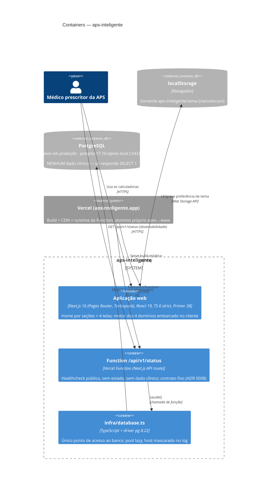

# C4 — Nível 2: Containers — aps-inteligente

> Regenerado pelo Reversa Architect em 2026-07-23 (re-extração nº 3).
> Escala de confiança: 🟢 CONFIRMADO · 🟡 INFERIDO · 🔴 LACUNA

🟢 A superfície cresceu além do container único da extração 1. Hoje há **três containers reais** — a aplicação web, a Function do healthcheck e o banco PostgreSQL — mais o `localStorage` de borda. O banco existe (feature 003) mas **não guarda dado clínico**: serve só para o healthcheck comprovar conectividade. A produção é servida no domínio próprio `apsinteligente.app` (feature 012). A feature 014 acrescentou um 4º domínio ao motor embarcado, **sem novo container**.

## Inventário de containers

| Container | Tecnologia | Estado | Observações |
|---|---|---|---|
| Aplicação web | Next.js 16.2.10, React 19.2.4, TS 6, Primer 38.33 | 🟢 ativo | Motor dos quatro domínios roda no cliente; nenhuma ida à rede com dado clínico; produção em `apsinteligente.app` |
| Function `/api/v1/status` | Vercel Function (API route) | 🟢 ativo (feature 002) | Antes fantasma; hoje contrato fixo `{atualizado_em, versao, commit}`, `no-store`, 405 + `Allow: GET` |
| Banco PostgreSQL | Neon (prod) · postgres:17.10-alpine (local :5433) | 🟢 ativo (feature 003) | Sem dado clínico; só `SELECT 1`. Acesso exclusivo por `infra/database.ts` |
| localStorage | Web Storage | 🟢 ativo | Exclusivamente tema; degradação graciosa se bloqueado |

## Comunicação

- 🟢 A única comunicação com dado clínico é **médico ↔ aplicação web**, e ela não deixa o navegador (o cálculo é local).
- 🟢 O caminho **Function → `infra/database.ts` → PostgreSQL** transporta apenas `SELECT 1`; o log é JSON estruturado **sem URL nem credencial**, com host mascarado (`hostMascarado`: 4 primeiros chars + `•••`). Sem retentativa automática — falha barulhenta (ADR 0004, Princípio nº 5.2).
- 🟢 Sem retorno de dado clínico pela Function: o corpo é só metadado de deploy (versão, commit, timestamp).
- 🟡 CSP e cabeçalhos de segurança são verificados pela suíte de contrato; a conferência byte a byte contra o repositório pré-refundação segue como item do Reviewer.
