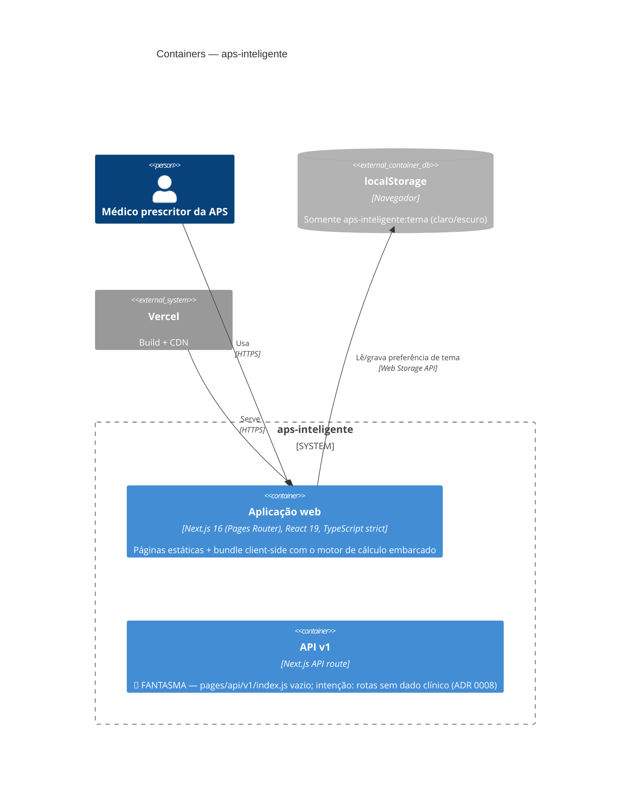

# C4 — Nível 2: Containers — aps-inteligente

> Gerado pelo Reversa Architect em 2026-07-19.
> Escala de confiança: 🟢 CONFIRMADO · 🟡 INFERIDO · 🔴 LACUNA

🟢 Arquitetonicamente há **um único container de runtime**: a aplicação web que a Vercel serve como estáticos e que executa no navegador. Banco de dados é ausente por design (ADR 0002); a API v1 é um container **fantasma** — declarado na estrutura de pastas, sem código.

## Inventário de containers

| Container | Tecnologia | Estado | Observações |
|---|---|---|---|
| Aplicação web | Next.js 16.2.10, React 19.2.4, TS 6 strict | 🟢 ativo | Único container real; motor de cálculo roda no cliente |
| API v1 | Next.js API route (Pages Router) | 🔴 fantasma | Arquivo vazio; requisições a `/api/v1` falham. Feature 002 (`/api/v1/status`) existiu antes da refundação e não foi reconstituída |
| Banco de dados | — | 🟢 ausente por design | Gatilho de revisão registrado (MD-0003/ADR 0002) |
| localStorage | Web Storage | 🟢 ativo | Exclusivamente tema; degradação graciosa se bloqueado |

## Comunicação

- 🟢 Não há comunicação entre containers em runtime além de web ↔ localStorage.
- 🟢 CSP sem terceiros existia na versão pré-refundação (commit `ebad6a5`); 🔴 não verificada na estrutura atual — item para a Spec Impact Matrix e o Reviewer.
