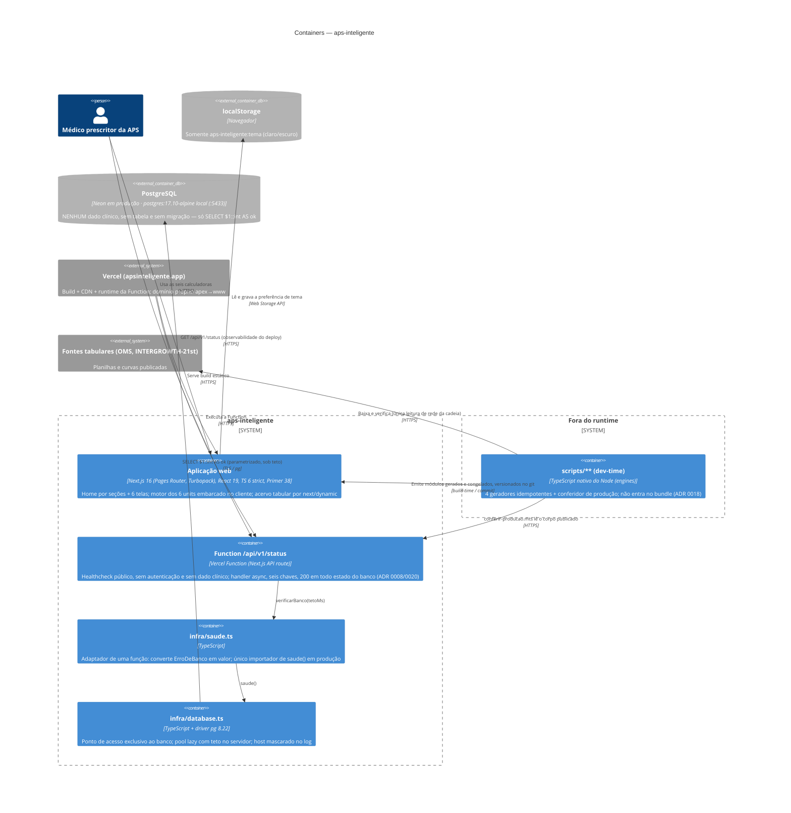

# C4 — Nível 2: Containers — aps-inteligente

> Regenerado pelo Reversa Architect em 2026-07-28 (re-extração nº 4).
> Escala de confiança: 🟢 CONFIRMADO · 🟡 INFERIDO · 🔴 LACUNA

🟢 Seguem **três containers reais** — a aplicação web, a Function do healthcheck e o banco —, mais o `localStorage` de borda. Duas coisas mudaram de natureza nesta passagem, e nenhuma delas acrescentou container: a Function **deixou de ser sem I/O**, e o banco **deixou de existir só para o teste**. Os dois units novos de domínio e as três telas novas cresceram dentro do container que já havia, porque o motor roda no cliente.

```mermaid
C4Container
    title Containers — aps-inteligente

    Person(medico, "Médico prescritor da APS")

    System_Boundary(aps, "aps-inteligente") {
        Container(web, "Aplicação web", "Next.js 16 (Pages Router, Turbopack), React 19, TS 6 strict, Primer 38", "Home por seções + 6 telas; motor dos 6 units embarcado no cliente; acervo tabular por next/dynamic")
        Container(api, "Function /api/v1/status", "Vercel Function (Next.js API route)", "Healthcheck público, sem autenticação e sem dado clínico; handler async, seis chaves, 200 em todo estado do banco (ADR 0008/0020)")
        Container(saude, "infra/saude.ts", "TypeScript", "Adaptador de uma função: converte ErroDeBanco em valor; único importador de saude() em produção")
        Container(infra, "infra/database.ts", "TypeScript + driver pg 8.22", "Ponto de acesso exclusivo ao banco; pool lazy com teto no servidor; host mascarado no log")
    }

    System_Boundary(dev, "Fora do runtime") {
        Container(scripts, "scripts/** (dev-time)", "TypeScript nativo do Node (engines)", "4 geradores idempotentes + conferidor de produção; não entra no bundle (ADR 0018)")
    }

    ContainerDb_Ext(ls, "localStorage", "Navegador", "Somente aps-inteligente:tema (claro/escuro)")
    ContainerDb_Ext(pg, "PostgreSQL", "Neon em produção · postgres:17.10-alpine local (:5433)", "NENHUM dado clínico, sem tabela e sem migração — só SELECT $1::int AS ok")
    System_Ext(vercel, "Vercel (apsinteligente.app)", "Build + CDN + runtime da Function; domínio próprio apex→www")
    System_Ext(fontes, "Fontes tabulares (OMS, INTERGROWTH-21st)", "Planilhas e curvas publicadas")

    Rel(medico, web, "Usa as seis calculadoras", "HTTPS")
    Rel(medico, api, "GET /api/v1/status (observabilidade do deploy)", "HTTPS")
    Rel(web, ls, "Lê e grava a preferência de tema", "Web Storage API")
    Rel(api, saude, "verificarBanco(tetoMs)")
    Rel(saude, infra, "saude()")
    Rel(infra, pg, "SELECT $1::int AS ok (parametrizado, sob teto)", "TLS / pg")
    Rel(vercel, web, "Serve build estático", "HTTPS")
    Rel(vercel, api, "Executa a Function", "HTTPS")
    Rel(scripts, fontes, "Baixa e verifica (única leitura de rede da cadeia)", "HTTPS")
    Rel(scripts, web, "Emite módulos gerados e congelados, versionados no git", "build-time / commit")
    Rel(scripts, api, "conferir-producao.mts lê o corpo publicado", "HTTPS")
    UpdateRelStyle(medico, web, $offsetY="-30")
```

## Inventário de containers

| Container | Tecnologia | Estado | Observações |
|---|---|---|---|
| Aplicação web | Next.js 16.2.10, React 19.2.4, TS 6, Primer 38.33 | 🟢 ativo | Motor dos seis units no cliente; sete rotas de página; nove folhas de estilo; nenhuma ida à rede com dado clínico |
| Function `/api/v1/status` | Vercel Function (API route) | 🟢 ativo (002, **alterado na 022**) | Passou a `async`; seis chaves; 405 com `Allow: GET` **antes de qualquer I/O**; `no-store` |
| `infra/saude.ts` | TypeScript | 🟢 **novo** (022) | Traduz desfecho em estado; não formata mensagem, não lê ambiente, não compõe resposta |
| `infra/database.ts` | TypeScript + pg 8.22 | 🟢 ativo (003, **alterado na 022**) | Teto configurável por `APS_TIMEOUT_SAUDE_MS` (padrão 3.000 ms) como `connectionTimeoutMillis` **e** `statement_timeout` |
| Banco PostgreSQL | Neon (prod) · postgres:17.10-alpine (local :5433) | 🟢 ativo, **com consumidor de produção** | Sem esquema de negócio; despertar da instância suspensa é o custo aceito por `MD-0032` |
| `localStorage` | Web Storage | 🟢 ativo | Exclusivamente tema; degradação graciosa se bloqueado |
| `scripts/**` | TypeScript nativo do Node | 🟢 **novo à extração** (017–022) | 23 arquivos, 5.517 linhas; fora do bundle; sem dependência nova no manifesto |

## Comunicação

- 🟢 A única comunicação com dado clínico é **médico ↔ aplicação web**, e ela não deixa o navegador. O registro em SOAP e o BR Code saem pela **área de transferência**, por ato do médico, e não por requisição.
- 🟢 O caminho **Function → `saude.ts` → `database.ts` → PostgreSQL** transporta apenas `SELECT $1::int AS ok`, sob teto imposto **no servidor**, porque o temporizador de cliente do driver não cancelaria nada e devolveria ao pool um cliente com resposta pendente. Log JSON estruturado **sem URL nem credencial**, com host mascarado. Sem retentativa automática: falha barulhenta.
- 🟢 **A falha do banco não sobe pelo código HTTP.** Chega ao consumidor como campo do corpo, com estado e causa em vocabulário público (`MD-0031`, ADR 0020). O corpo revela se o banco está íntegro ou degradado, e nada nele identifica instância, credencial ou consulta — o que a suíte de contrato afere nos **dois** estados.
- 🟢 **A camada dev-time não fala com o runtime**: comunica-se com o repositório, emitindo artefatos versionados, e o `git diff` vazio é a prova de que a origem não mudou.
- 🟡 CSP e cabeçalhos de segurança são verificados pela suíte de contrato, que no CI roda contra **dois** servidores, um íntegro e outro com o banco inalcançável.
