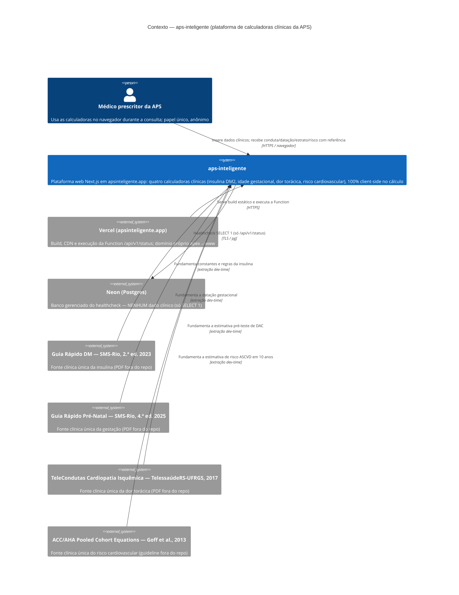

# C4 — Nível 1: Contexto — aps-inteligente

> Regenerado pelo Reversa Architect em 2026-07-23 (re-extração nº 3).
> Escala de confiança: 🟢 CONFIRMADO · 🟡 INFERIDO · 🔴 LACUNA

🟢 O cálculo clínico dos quatro domínios roda inteiro no navegador (ADR 0002). Os atores externos são o médico prescritor, a plataforma de hospedagem (build/deploy/Function, hoje sob `apsinteligente.app`), o banco gerenciado do healthcheck (sem dado clínico) e as **quatro fontes clínicas** — estas dependências **editoriais**, não técnicas, uma por domínio.

## Observações

- 🟢 **Nenhum dado clínico sai do dispositivo:** não há analytics nem telemetria (ADR 0007), e a única ida à rede em runtime é o healthcheck, que não carrega dado clínico. O único armazenamento local é a preferência de tema. O link à AHA PREVENT no risco CV é navegação do usuário (`<a>`), não requisição.
- 🟢 **Uma fonte por domínio** (ADR 0001/0011): as quatro fontes não se misturam; cada tela cita só a sua. Nova edição de qualquer guia é gatilho de revisão registrado (MD-0008). A escolha das PCE sobre a AHA PREVENT é registrada (ADR 0014).
- 🟡 As personas do PRD são variações do mesmo ator técnico "médico prescritor" — papel único, anônimo, sem autenticação (`permissions.md`).
