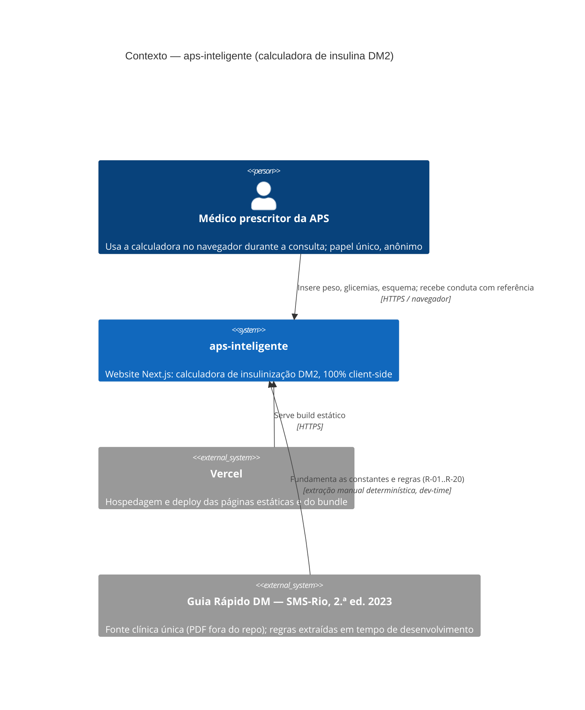

# C4 — Nível 1: Contexto — aps-inteligente

> Gerado pelo Reversa Architect em 2026-07-19.
> Escala de confiança: 🟢 CONFIRMADO · 🟡 INFERIDO · 🔴 LACUNA

🟢 O sistema não possui **nenhuma integração de runtime**: o cálculo roda inteiro no navegador (ADR 0002). Os únicos atores externos são o médico prescritor, a plataforma de hospedagem (build/deploy) e a fonte clínica — esta última uma dependência **editorial**, não técnica.

## Observações

- 🟢 **Nenhum dado sai do dispositivo**: não há analytics, telemetria (ADR 0007) nem backend com estado; o único armazenamento local é a preferência de tema.
- 🟡 As três personas do PRD antigo (recuperáveis no bundle) são variações do mesmo ator técnico "médico prescritor".
- 🔴 Rota `pages/api/v1/` vazia: a fronteira de sistema já reserva espaço para uma API sem dado clínico (ADR 0008), hoje inexistente.
