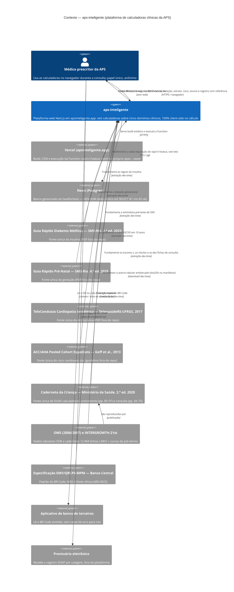

# C4 — Nível 1: Contexto — aps-inteligente

> Regenerado pelo Reversa Architect em 2026-07-28 (re-extração nº 4).
> Escala de confiança: 🟢 CONFIRMADO · 🟡 INFERIDO · 🔴 LACUNA

🟢 O cálculo clínico dos cinco domínios roda inteiro no navegador (ADR 0002). Os atores externos são o médico prescritor, a plataforma de hospedagem, o banco gerenciado do healthcheck (sem dado clínico) e as **fontes clínicas**, que são dependências **editoriais** e não técnicas. Duas novidades desta passagem: a *Caderneta da Criança* é fonte editorial única de **duas** calculadoras, reproduzindo dados da OMS e do INTERGROWTH-21st sob ela (`MD-0001`), e a plataforma passou a **emitir** dois contratos consumidos fora dela.

```mermaid
C4Context
    title Contexto — aps-inteligente (plataforma de calculadoras clínicas da APS)

    Person(medico, "Médico prescritor da APS", "Usa as calculadoras no navegador durante a consulta; papel único, anônimo")

    System(aps, "aps-inteligente", "Plataforma web Next.js em apsinteligente.app: seis calculadoras sobre cinco domínios clínicos, 100% client-side no cálculo")

    System_Ext(vercel, "Vercel (apsinteligente.app)", "Build, CDN e execução da Function /api/v1/status; domínio próprio apex→www")
    System_Ext(neon, "Neon (Postgres)", "Banco gerenciado do healthcheck — NENHUM dado clínico (só SELECT $1::int AS ok)")

    System_Ext(guiaDm, "Guia Rápido Diabetes Mellitus — SMS-Rio, 2.ª ed. 2023", "Fonte única da insulina (PDF fora do repo)")
    System_Ext(guiaPn, "Guia Rápido Pré-Natal — SMS-Rio, 4.ª ed. 2025", "Fonte única da gestação (PDF fora do repo)")
    System_Ext(teleC, "TeleCondutas Cardiopatia Isquêmica — TelessaúdeRS-UFRGS, 2017", "Fonte única da dor torácica (PDF fora do repo)")
    System_Ext(pce, "ACC/AHA Pooled Cohort Equations — Goff et al., 2013", "Fonte única do risco cardiovascular (guideline fora do repo)")
    System_Ext(caderneta, "Caderneta da Criança — Ministério da Saúde, 2.ª ed. 2020", "Fonte única de DUAS calculadoras: crescimento (pp. 85-97) e consulta (pp. 66-75)")
    System_Ext(curvas, "OMS (2006/2007) e INTERGROWTH-21st", "Dados tabulares SOB a caderneta: 12.964 linhas L/M/S + curvas do pré-termo")
    System_Ext(bcb, "Especificação EMV/QRCPS-MPM — Banco Central", "Padrão do BR Code; NÃO é fonte clínica (MD-0022)")

    System_Ext(banco, "Aplicativo de banco de terceiros", "Lê o BR Code emitido; sem canal de erro para nós")
    System_Ext(prontuario, "Prontuário eletrônico", "Recebe o registro SOAP por colagem, fora da plataforma")

    Rel(medico, aps, "Insere dados clínicos; recebe conduta, datação, estrato, risco, escore e registro com referência", "HTTPS / navegador")
    Rel(vercel, aps, "Serve build estático e executa a Function", "HTTPS")
    Rel(aps, neon, "Healthcheck a cada requisição de /api/v1/status, sob teto", "TLS / pg")
    Rel(guiaDm, aps, "Fundamenta as regras da insulina", "extração dev-time")
    Rel(guiaPn, aps, "Fundamenta a datação gestacional", "extração dev-time")
    Rel(teleC, aps, "Fundamenta a estimativa pré-teste de DAC", "extração dev-time")
    Rel(pce, aps, "Fundamenta o risco ASCVD em 10 anos", "extração dev-time")
    Rel(caderneta, aps, "Fundamenta os escores z, os rótulos e as dez fichas de consulta", "extração dev-time")
    Rel(curvas, caderneta, "São reproduzidas por", "publicação")
    Rel(curvas, aps, "Alimentam o acervo tabular embarcado (sha256 no manifesto)", "download dev-time")
    Rel(bcb, aps, "Fixa o formato do BR Code", "transcrição dev-time")
    Rel(medico, banco, "Lê o QR ou cola o código copiado", "câmera / área de transferência")
    Rel(medico, prontuario, "Cola o registro em SOAP", "área de transferência")
    Rel(aps, medico, "Emite BR Code e registro SOAP no cliente", "sem rede")
```

## Observações

- 🟢 **Nenhum dado clínico sai do dispositivo pela rede.** Não há analytics nem telemetria (ADR 0007), e a única ida à rede em runtime é o healthcheck, que não carrega dado clínico. O registro em SOAP contém dados da criança e **sai pela área de transferência, por ato do médico**, jamais por requisição: a plataforma não sabe que ele foi copiado.
- 🟢 **Uma fonte por unit, e não uma por calculadora** (ADR 0011/0017): a caderneta é fonte única de duas calculadoras, em seções distintas do mesmo impresso. As seis fontes não se misturam, e cada tela cita só a sua. Nova edição de qualquer uma é gatilho de revisão (`MD-0008`), agora com o `sha256` do manifesto como sentinela nas tabelas.
- 🟢 **Dois contratos emitidos, e é a diferença de natureza que importa**: o BR Code é lido por software de terceiros **sem canal de erro** para nós, e o registro SOAP tem a forma como promessa a quem o cola todo dia. Ambos são verificados em duas pontas, uma automatizada e outra humana.
- 🟢 **A especificação do Banco Central não é fonte clínica** e não entra no catálogo congelado de referências: a isenção é declarada (`MD-0022`, ADR 0016).
- 🟡 As personas do PRD são variações do mesmo ator técnico, sem autenticação (`permissions.md`). A criança e o paciente são **sujeitos dos dados**, nunca usuários, e nenhum campo os identifica.
