# ERD Completo — aps-inteligente

> Gerado pelo Reversa Architect em 2026-07-19.
> Escala de confiança: 🟢 CONFIRMADO · 🟡 INFERIDO · 🔴 LACUNA

🟢 **Não há banco de dados** (ausência por design, ADR 0002): este ERD modela as **entidades em memória** do domínio (`models/insulina/tipos.ts`), efêmeras por cálculo. Não existem chaves primárias nem estrangeiras — as "relações" são composição de objetos imutáveis. Cardinalidades refletem os contratos TypeScript.

```mermaid
erDiagram
    ENTRADA_CALCULO {
        string modo "inicio | titulacao"
        number pesoKg "0 < p <= 350"
        number hba1cPercent "opcional; 3-20"
        boolean usoSulfonilureia "opcional; undefined = nao informado"
    }
    GLICEMIA_AFERIDA {
        number valorMgDl "10-1000"
        string momento "jejum | antes_almoco | antes_jantar | ao_deitar"
    }
    ESQUEMA_INSULINA {
        string tipo "basal | basal-plus | basal-bolus"
    }
    APLICACAO_INSULINA {
        string insulina "NPH | Regular"
        string momento "antes_cafe | antes_almoco | antes_jantar | ao_deitar"
        number doseUi "inteira 1-60"
    }
    SAIDA_CALCULO {
        string tipo "resultado | erro-validacao | fora-do-escopo"
    }
    RESULTADO_INICIO {
        string modo "inicio"
    }
    RESULTADO_TITULACAO {
        string modo "titulacao"
        number doseTotalDiaUi
        number deltaTotalUi "pode ser negativo"
        boolean naMeta
    }
    FAIXA_UI {
        number minUi
        number maxUi
    }
    ALERTA {
        string tipo "5 valores; ordenados por SEVERIDADE"
        string mensagem
    }
    RECOMENDACAO {
        string tipo "11 valores; chave de dedupe"
        string mensagem
    }
    REFERENCIA_CLINICA {
        string fonteId "sempre guia-rapido-dm-sms-rio"
        string versaoEdicao "2a ed. atualizada, 2023"
        string localizacao "pagina/figura; chave de dedupe"
    }
    CONDUTA_ALTERNATIVA {
        string rotulo
    }
    ERRO_VALIDACAO {
        string tipo "erro-validacao"
    }
    OFENSOR {
        string campo "path notation"
        string codigo "7 valores de CodigoErro"
        string mensagem
    }
    FORA_DO_ESCOPO {
        string tipo "fora-do-escopo"
        string orientacao
    }

    ENTRADA_CALCULO ||--o{ GLICEMIA_AFERIDA : "glicemias (>=1 na titulacao)"
    ENTRADA_CALCULO ||--o| ESQUEMA_INSULINA : "esquemaAtual (obrigatorio na titulacao)"
    ESQUEMA_INSULINA ||--|{ APLICACAO_INSULINA : "aplicacoes (nao vazio)"

    SAIDA_CALCULO ||--o| RESULTADO_INICIO : "variante"
    SAIDA_CALCULO ||--o| RESULTADO_TITULACAO : "variante"
    SAIDA_CALCULO ||--o| ERRO_VALIDACAO : "variante"
    SAIDA_CALCULO ||--o| FORA_DO_ESCOPO : "variante"

    RESULTADO_INICIO ||--|| FAIXA_UI : "faixaDoseUi (10-15)"
    RESULTADO_INICIO ||--|| FAIXA_UI : "faixaPorPesoUi"
    RESULTADO_INICIO ||--|| APLICACAO_INSULINA : "aplicacaoSugerida (NPH ao deitar, sem dose)"
    RESULTADO_INICIO ||--o{ ALERTA : "alertas"
    RESULTADO_INICIO ||--|{ RECOMENDACAO : "recomendacoesAoPrescritor"
    RESULTADO_INICIO ||--|{ REFERENCIA_CLINICA : "referencias (>=1)"

    RESULTADO_TITULACAO ||--|{ APLICACAO_INSULINA : "esquemaSugerido"
    RESULTADO_TITULACAO ||--o{ CONDUTA_ALTERNATIVA : "condutasAlternativas (so quando >=1)"
    RESULTADO_TITULACAO ||--o{ ALERTA : "alertas"
    RESULTADO_TITULACAO ||--o{ RECOMENDACAO : "recomendacoesAoPrescritor"
    RESULTADO_TITULACAO ||--|{ REFERENCIA_CLINICA : "referencias (>=1)"

    CONDUTA_ALTERNATIVA ||--|{ APLICACAO_INSULINA : "esquemaSugerido"
    CONDUTA_ALTERNATIVA ||--|| REFERENCIA_CLINICA : "referencia"
    ALERTA ||--|| REFERENCIA_CLINICA : "referencia"
    RECOMENDACAO ||--|| REFERENCIA_CLINICA : "referencia"
    ERRO_VALIDACAO ||--|{ OFENSOR : "ofensores (>=1)"
    FORA_DO_ESCOPO ||--|| REFERENCIA_CLINICA : "referencia"
```

## Invariantes estruturais (verificados por property-based testing)

1. 🟢 Todo `Alerta`, `Recomendacao`, `CondutaAlternativa` e resultado carrega `ReferenciaClinica` — nenhuma saída sem fonte.
2. 🟢 `AplicacaoInsulina.doseUi` é sempre inteira 1–60 (value object `DoseUi`); esquemas sugeridos são sempre realizáveis na caneta do SUS.
3. 🟢 O motor é determinístico: mesma `EntradaCalculo` → mesma `SaidaCalculo`.
4. 🟢 `RESULTADO_INICIO.aplicacaoSugerida` não fixa dose (AMB-01) — o par faixa absoluta + faixa por peso é quem informa.

## View models da interface (fora do domínio)

`EstadoResultado`, `LinhaGlicemia`, `LinhaAplicacao`, `EventoDeErro`, `Tema` — descritos no `data-dictionary.md` e em `state-machines.md`; não participam do contrato do motor.
