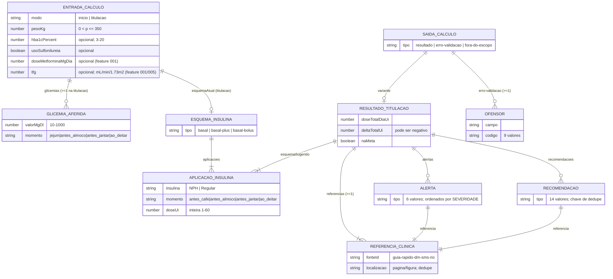
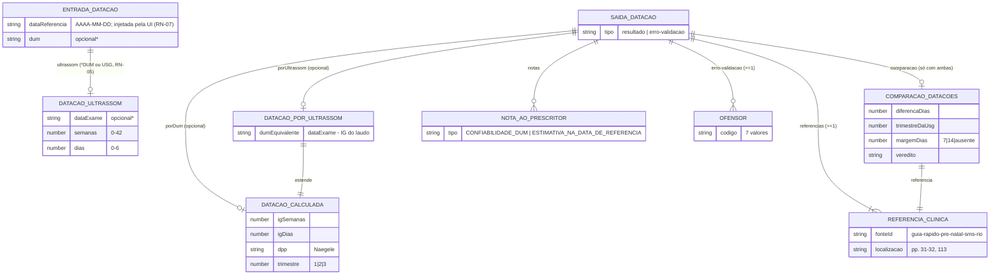
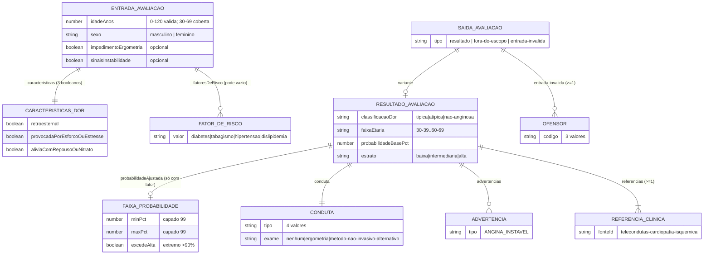
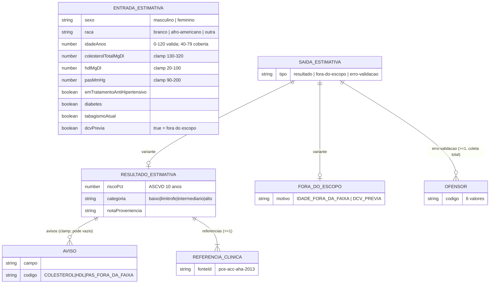
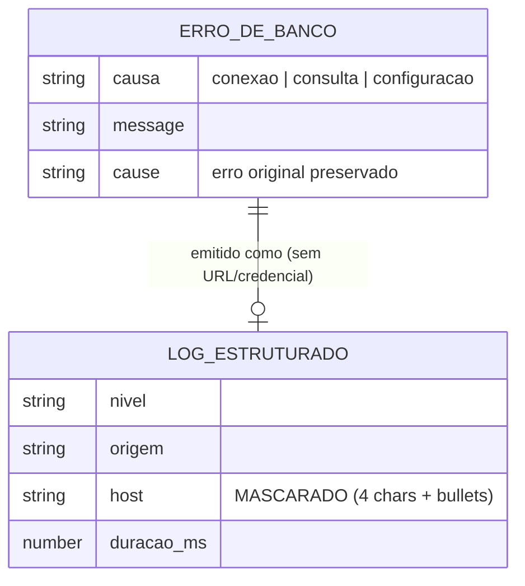

# ERD Completo — aps-inteligente

> Regenerado pelo Reversa Architect em 2026-07-23 (re-extração nº 3).
> Escala de confiança: 🟢 CONFIRMADO · 🟡 INFERIDO · 🔴 LACUNA

🟢 **Não há persistência de dado clínico** (ADR 0002). O banco PostgreSQL existe (feature 003) mas responde só `SELECT 1` — não tem esquema clínico. Os ERDs abaixo modelam as **entidades em memória** dos quatro domínios (`models/*/tipos.ts`), efêmeras por cálculo: não há PK/FK, as "relações" são composição de objetos imutáveis, e as cardinalidades refletem os contratos TypeScript.

## Domínio 1 — `models/insulina`

## Domínio 2 — `models/gestacao` (feature 007)

🟢 **Veredito** ∈ `dum-confirmada` / `dum-fora-da-margem` / `sem-parametro-na-fonte`. O 3.º trimestre não tem margem na fonte → `sem-parametro-na-fonte`.

## Domínio 3 — `models/cardiopatia-isquemica` (feature 010)

🟢 **Matriz `PROBABILIDADE_PRE_TESTE`** (Quadro 2, 24 células %, congelada): não anginosa M `4/13/20/27`, F `2/3/7/14`; atípica M `34/51/65/72`, F `12/22/31/51`; típica M `76/87/93/94`, F `26/55/73/86` (faixas `30-39/40-49/50-59/60-69`). Detalhe no `data-dictionary.md`.

## Domínio 4 — `models/risco-cardiovascular` (feature 014)

🟢 **Coeficientes PCE congelados** (`COEFICIENTES` 4×13, `BASELINE_SURVIVAL`, `MEANS`): quatro modelos de Cox sexo×raça, precisão estendida validada contra `CVrisk`/`PooledCohort`. Detalhe no `data-dictionary.md` §"Domínio 4".

## Infraestrutura — banco (sem dado clínico)

🟢 O PostgreSQL não tem esquema clínico. A única "entidade" relevante à extração é o **erro de infraestrutura**, não uma tabela:

## Invariantes estruturais (verificados por property-based testing)

1. 🟢 Toda saída dos quatro domínios carrega ao menos uma `ReferenciaClinica` — nenhuma conduta, datação, estrato ou risco sem fonte.
2. 🟢 `AplicacaoInsulina.doseUi` é sempre inteira 1–60 (value object `DoseUi`) — esquemas sempre realizáveis na caneta do SUS.
3. 🟢 Os quatro motores são determinísticos: mesma entrada → mesma saída (gestação recebe a data de referência como entrada, não lê o relógio).
4. 🟢 A cardiopatia recusa idade fora de 30–69, e o risco CV recusa idade fora de 40–79 ou DCV prévia, com `ForaDoEscopoDaFonte`, **sem número estimado** — não extrapolam a fonte.
5. 🟢 O risco CV é sempre 0–100% e sua categoria é monotônica no risco; valor fora da faixa fisiológica é clampado e sinalizado, nunca travado (invariantes property-based).

## View models da interface (fora do domínio)

`EstadoResultado`/`EstadoIg`/`EstadoCardiologia`, `EventoDeErro`, `Tema` — descritos em `data-dictionary.md` e `state-machines.md`; não participam do contrato dos motores.
