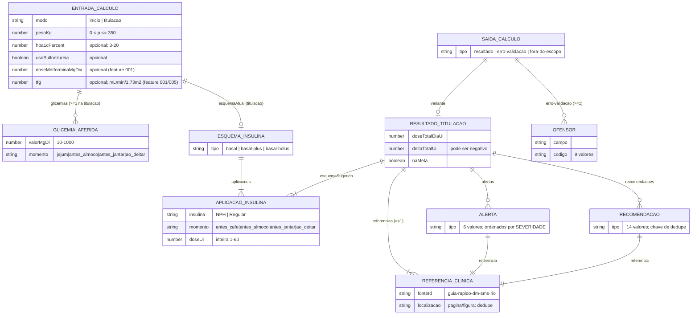
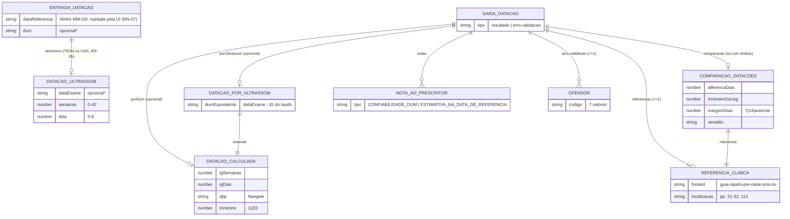
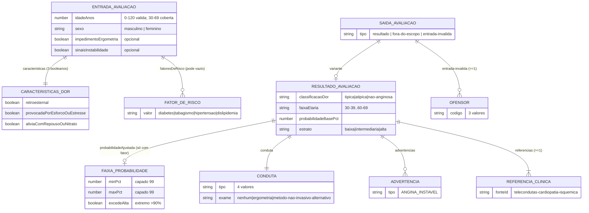
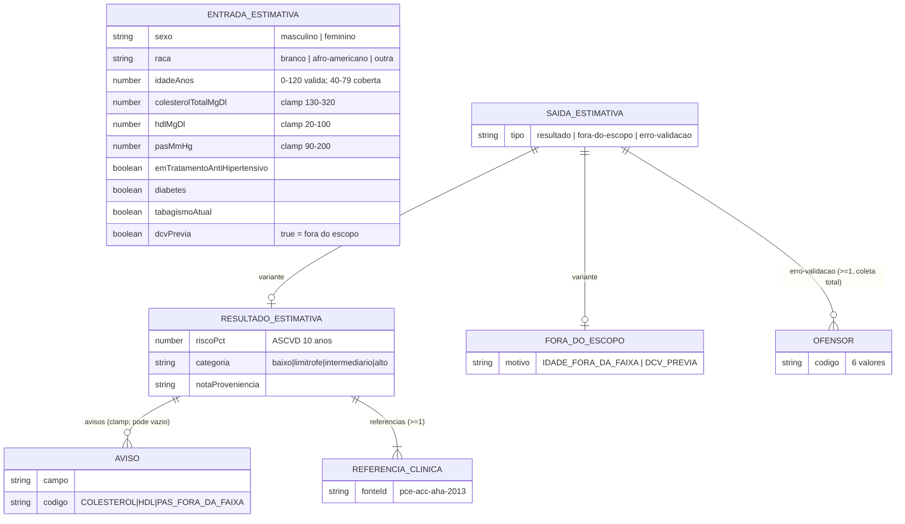
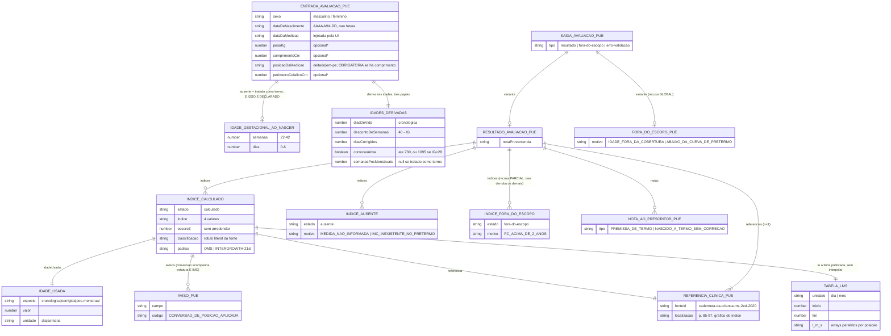
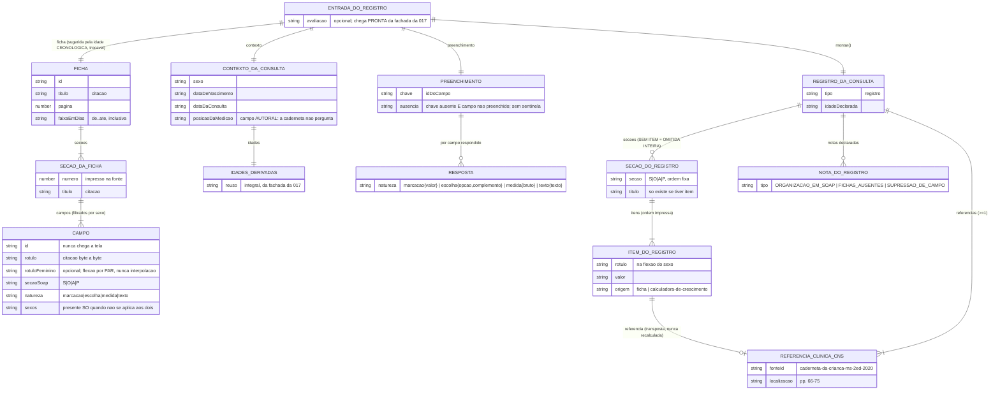
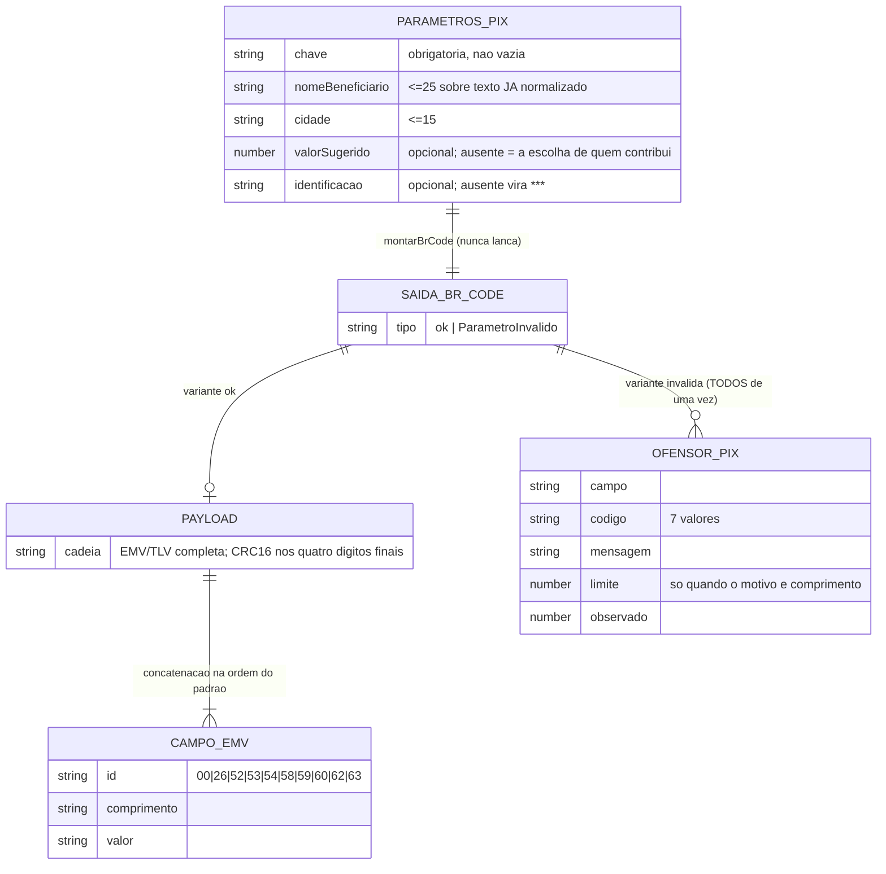
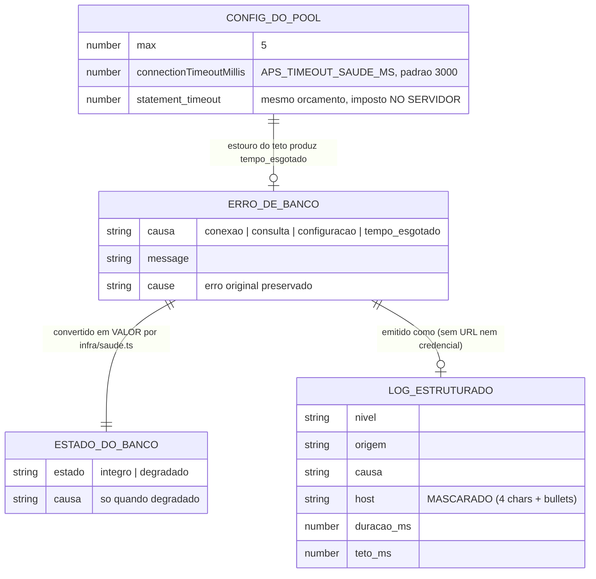
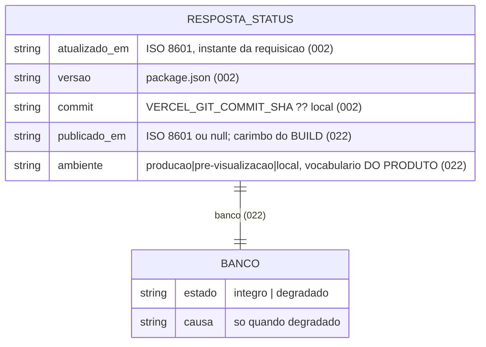

# ERD Completo — aps-inteligente

> Regenerado pelo Reversa Architect em 2026-07-28 (re-extração nº 4 — acrescenta os domínios 5, 5b e 6, a quarta causa de erro de banco e o corpo de seis chaves da API).
> Escala de confiança: 🟢 CONFIRMADO · 🟡 INFERIDO · 🔴 LACUNA

🟢 **Não há persistência de dado clínico** (ADR 0002). O banco PostgreSQL existe (feature 003) e, desde a feature 022, tem consumidor de produção, mas **não tem esquema clínico**: responde `SELECT $1::int AS ok`. Os ERDs abaixo modelam as **entidades em memória** dos seis units (`models/*/tipos.ts`), efêmeras por cálculo: não há PK nem FK, as "relações" são composição de objetos imutáveis, e as cardinalidades refletem os contratos TypeScript.

## Domínio 1 — `models/insulina`

```mermaid
erDiagram
    ENTRADA_CALCULO {
        string modo "inicio | titulacao"
        number pesoKg "0 < p <= 350"
        number hba1cPercent "opcional; 3-20"
        boolean usoSulfonilureia "opcional"
        number doseMetforminaMgDia "opcional (feature 001)"
        number tfg "opcional; mL/min/1.73m2 (feature 001/005)"
    }
    GLICEMIA_AFERIDA { number valorMgDl "10-1000" string momento "jejum|antes_almoco|antes_jantar|ao_deitar" }
    ESQUEMA_INSULINA { string tipo "basal | basal-plus | basal-bolus" }
    APLICACAO_INSULINA { string insulina "NPH | Regular" string momento "antes_cafe|antes_almoco|antes_jantar|ao_deitar" number doseUi "inteira 1-60" }
    SAIDA_CALCULO { string tipo "resultado | erro-validacao | fora-do-escopo" }
    RESULTADO_TITULACAO { number doseTotalDiaUi number deltaTotalUi "pode ser negativo" boolean naMeta }
    ALERTA { string tipo "6 valores; ordenados por SEVERIDADE" }
    RECOMENDACAO { string tipo "14 valores; chave de dedupe" }
    REFERENCIA_CLINICA { string fonteId "guia-rapido-dm-sms-rio" string localizacao "pagina/figura; dedupe" }
    OFENSOR { string campo string codigo "9 valores" }

    ENTRADA_CALCULO ||--o{ GLICEMIA_AFERIDA : "glicemias (>=1 na titulacao)"
    ENTRADA_CALCULO ||--o| ESQUEMA_INSULINA : "esquemaAtual (titulacao)"
    ESQUEMA_INSULINA ||--|{ APLICACAO_INSULINA : "aplicacoes"
    SAIDA_CALCULO ||--o| RESULTADO_TITULACAO : "variante"
    RESULTADO_TITULACAO ||--|{ APLICACAO_INSULINA : "esquemaSugerido"
    RESULTADO_TITULACAO ||--o{ ALERTA : "alertas"
    RESULTADO_TITULACAO ||--o{ RECOMENDACAO : "recomendacoes"
    RESULTADO_TITULACAO ||--|{ REFERENCIA_CLINICA : "referencias (>=1)"
    SAIDA_CALCULO ||--o{ OFENSOR : "erro-validacao (>=1)"
    ALERTA ||--|| REFERENCIA_CLINICA : "referencia"
    RECOMENDACAO ||--|| REFERENCIA_CLINICA : "referencia"
```

## Domínio 2 — `models/gestacao` (feature 007)

```mermaid
erDiagram
    ENTRADA_DATACAO { string dataReferencia "AAAA-MM-DD; injetada pela UI (RN-07)" string dum "opcional*" }
    DATACAO_ULTRASSOM { string dataExame "opcional*" number semanas "0-42" number dias "0-6" }
    SAIDA_DATACAO { string tipo "resultado | erro-validacao" }
    DATACAO_CALCULADA { number igSemanas number igDias string dpp "Naegele" number trimestre "1|2|3" }
    DATACAO_POR_ULTRASSOM { string dumEquivalente "dataExame - IG do laudo" }
    COMPARACAO_DATACOES { number diferencaDias number trimestreDaUsg number margemDias "7|14|ausente" string veredito }
    NOTA_AO_PRESCRITOR { string tipo "CONFIABILIDADE_DUM | ESTIMATIVA_NA_DATA_DE_REFERENCIA" }
    REFERENCIA_CLINICA { string fonteId "guia-rapido-pre-natal-sms-rio" string localizacao "pp. 31-32, 113" }
    OFENSOR { string codigo "7 valores" }

    ENTRADA_DATACAO ||--o| DATACAO_ULTRASSOM : "ultrassom (*DUM ou USG, RN-05)"
    SAIDA_DATACAO ||--o| DATACAO_CALCULADA : "porDum (opcional)"
    SAIDA_DATACAO ||--o| DATACAO_POR_ULTRASSOM : "porUltrassom (opcional)"
    SAIDA_DATACAO ||--o| COMPARACAO_DATACOES : "comparacao (só com ambas)"
    DATACAO_POR_ULTRASSOM ||--|| DATACAO_CALCULADA : "estende"
    SAIDA_DATACAO ||--o{ NOTA_AO_PRESCRITOR : "notas"
    SAIDA_DATACAO ||--|{ REFERENCIA_CLINICA : "referencias (>=1)"
    SAIDA_DATACAO ||--o{ OFENSOR : "erro-validacao (>=1)"
    COMPARACAO_DATACOES ||--|| REFERENCIA_CLINICA : "referencia"
```

🟢 **Veredito** ∈ `dum-confirmada` / `dum-fora-da-margem` / `sem-parametro-na-fonte`. O 3.º trimestre não tem margem na fonte.

## Domínio 3 — `models/cardiopatia-isquemica` (feature 010)

```mermaid
erDiagram
    ENTRADA_AVALIACAO { number idadeAnos "0-120 valida; 30-69 coberta" string sexo "masculino | feminino" boolean impedimentoErgometria "opcional" boolean sinaisInstabilidade "opcional" }
    CARACTERISTICAS_DOR { boolean retroesternal boolean provocadaPorEsforcoOuEstresse boolean aliviaComRepousoOuNitrato }
    FATOR_DE_RISCO { string valor "diabetes|tabagismo|hipertensao|dislipidemia" }
    SAIDA_AVALIACAO { string tipo "resultado | fora-do-escopo | entrada-invalida" }
    RESULTADO_AVALIACAO { string classificacaoDor "tipica|atipica|nao-anginosa" string faixaEtaria "30-39..60-69" number probabilidadeBasePct string estrato "baixa|intermediaria|alta" }
    FAIXA_PROBABILIDADE { number minPct "capado 99" number maxPct "capado 99" boolean excedeAlta "extremo >90%" }
    CONDUTA { string tipo "4 valores" string exame "nenhum|ergometria|metodo-nao-invasivo-alternativo" }
    ADVERTENCIA { string tipo "ANGINA_INSTAVEL" }
    REFERENCIA_CLINICA { string fonteId "telecondutas-cardiopatia-isquemica" }
    OFENSOR { string codigo "3 valores" }

    ENTRADA_AVALIACAO ||--|| CARACTERISTICAS_DOR : "caracteristicas (3 booleanos)"
    ENTRADA_AVALIACAO ||--o{ FATOR_DE_RISCO : "fatoresDeRisco (pode vazio)"
    SAIDA_AVALIACAO ||--o| RESULTADO_AVALIACAO : "variante"
    RESULTADO_AVALIACAO ||--o| FAIXA_PROBABILIDADE : "probabilidadeAjustada (só com fator)"
    RESULTADO_AVALIACAO ||--|| CONDUTA : "conduta"
    RESULTADO_AVALIACAO ||--o{ ADVERTENCIA : "advertencias"
    RESULTADO_AVALIACAO ||--|{ REFERENCIA_CLINICA : "referencias (>=1)"
    SAIDA_AVALIACAO ||--o{ OFENSOR : "entrada-invalida (>=1)"
```

🟢 **Matriz `PROBABILIDADE_PRE_TESTE`** (Quadro 2, 24 células %, congelada): não anginosa M `4/13/20/27`, F `2/3/7/14`; atípica M `34/51/65/72`, F `12/22/31/51`; típica M `76/87/93/94`, F `26/55/73/86`.

## Domínio 4 — `models/risco-cardiovascular` (feature 014)

```mermaid
erDiagram
    ENTRADA_ESTIMATIVA { string sexo "masculino | feminino" string raca "branco | afro-americano | outra" number idadeAnos "0-120 valida; 40-79 coberta" number colesterolTotalMgDl "clamp 130-320" number hdlMgDl "clamp 20-100" number pasMmHg "clamp 90-200" boolean emTratamentoAntiHipertensivo boolean diabetes boolean tabagismoAtual boolean dcvPrevia "true = fora do escopo" }
    SAIDA_ESTIMATIVA { string tipo "resultado | fora-do-escopo | erro-validacao" }
    RESULTADO_ESTIMATIVA { number riscoPct "ASCVD 10 anos" string categoria "baixo|limitrofe|intermediario|alto" string notaProveniencia }
    AVISO { string campo string codigo "COLESTEROL|HDL|PAS_FORA_DA_FAIXA" }
    FORA_DO_ESCOPO { string motivo "IDADE_FORA_DA_FAIXA | DCV_PREVIA" }
    REFERENCIA_CLINICA { string fonteId "pce-acc-aha-2013" }
    OFENSOR { string codigo "6 valores" }

    SAIDA_ESTIMATIVA ||--o| RESULTADO_ESTIMATIVA : "variante"
    SAIDA_ESTIMATIVA ||--o| FORA_DO_ESCOPO : "variante"
    SAIDA_ESTIMATIVA ||--o{ OFENSOR : "erro-validacao (>=1, coleta total)"
    RESULTADO_ESTIMATIVA ||--o{ AVISO : "avisos (clamp; pode vazio)"
    RESULTADO_ESTIMATIVA ||--|{ REFERENCIA_CLINICA : "referencias (>=1)"
```

## 🆕 Domínio 5 — `models/puericultura` (feature 017)

🟢 O mais ramificado da plataforma, e o único com **duas espécies de recusa**. Nota de leitura: o discriminante da **saída** é `tipo`, como nos quatro anteriores; o do **índice** é `estado`, para que um resultado com quatro índices não tenha cinco campos `tipo` de significados distintos.

```mermaid
erDiagram
    ENTRADA_AVALIACAO_PUE { string sexo "masculino | feminino" string dataDeNascimento "AAAA-MM-DD, nao futura" string dataDaMedicao "injetada pela UI" number pesoKg "opcional*" number comprimentoCm "opcional*" string posicaoDaMedicao "deitado|em-pe; OBRIGATORIA se ha comprimento" number perimetroCefalicoCm "opcional*" }
    IDADE_GESTACIONAL_AO_NASCER { number semanas "22-42" number dias "0-6" }
    IDADES_DERIVADAS { number diasDeVida "cronologica" number descontoDeSemanas "40 - IG" number diasCorrigidos boolean correcaoAtiva "ate 730, ou 1095 se IG<28" number semanasPosMenstruais "null se tratado como termo" }
    SAIDA_AVALIACAO_PUE { string tipo "resultado | fora-do-escopo | erro-validacao" }
    RESULTADO_AVALIACAO_PUE { string notaProveniencia }
    INDICE_CALCULADO { string estado "calculado" string indice "4 valores" number escoreZ "sem arredondar" string classificacao "rotulo literal da fonte" string padrao "OMS | INTERGROWTH-21st" }
    INDICE_AUSENTE { string estado "ausente" string motivo "MEDIDA_NAO_INFORMADA | IMC_INEXISTENTE_NO_PRETERMO" }
    INDICE_FORA_DO_ESCOPO { string estado "fora-do-escopo" string motivo "PC_ACIMA_DE_2_ANOS" }
    IDADE_USADA { string especie "cronologica|corrigida|pos-menstrual" number valor string unidade "dia|semana" }
    AVISO_PUE { string campo string codigo "CONVERSAO_DE_POSICAO_APLICADA" }
    NOTA_AO_PRESCRITOR_PUE { string tipo "PREMISSA_DE_TERMO | NASCIDO_A_TERMO_SEM_CORRECAO" }
    FORA_DO_ESCOPO_PUE { string motivo "IDADE_FORA_DA_COBERTURA | ABAIXO_DA_CURVA_DE_PRETERMO" }
    REFERENCIA_CLINICA_PUE { string fonteId "caderneta-da-crianca-ms-2ed-2020" string localizacao "p. 85-97, grafico do indice" }
    TABELA_LMS { string unidade "dia | mes" number inicio number fim string l_m_s "arrays paralelos por posicao" }

    ENTRADA_AVALIACAO_PUE ||--o| IDADE_GESTACIONAL_AO_NASCER : "ausente = tratada como termo, E ISSO E DECLARADO"
    ENTRADA_AVALIACAO_PUE ||--|| IDADES_DERIVADAS : "deriva tres idades, tres papeis"
    SAIDA_AVALIACAO_PUE ||--o| RESULTADO_AVALIACAO_PUE : "variante"
    SAIDA_AVALIACAO_PUE ||--o| FORA_DO_ESCOPO_PUE : "variante (recusa GLOBAL)"
    RESULTADO_AVALIACAO_PUE ||--o{ INDICE_CALCULADO : "indices"
    RESULTADO_AVALIACAO_PUE ||--o{ INDICE_AUSENTE : "indices"
    RESULTADO_AVALIACAO_PUE ||--o{ INDICE_FORA_DO_ESCOPO : "indices (recusa PARCIAL, nao derruba os demais)"
    INDICE_CALCULADO ||--|| IDADE_USADA : "idadeUsada"
    INDICE_CALCULADO ||--o{ AVISO_PUE : "avisos (conversao acompanha estatura E IMC)"
    INDICE_CALCULADO ||--|| REFERENCIA_CLINICA_PUE : "referencia"
    INDICE_CALCULADO ||--|| TABELA_LMS : "le a linha publicada, sem interpolar"
    RESULTADO_AVALIACAO_PUE ||--o{ NOTA_AO_PRESCRITOR_PUE : "notas"
    RESULTADO_AVALIACAO_PUE ||--|{ REFERENCIA_CLINICA_PUE : "referencias (>=1)"
```

🟢 **Acervo tabular:** 14 combinações (4 peso, 4 estatura, 4 IMC, 2 perímetro cefálico), 12.964 linhas, `sha256` por origem no `manifesto.json`. Unidade trocada ou array mais curto que a faixa declarada lançam `ErroDeInvariante` na montagem, porque produziriam escore silenciosamente errado.

🟢 **Fronteiras numéricas que não coincidem de propósito:** rótulo do IMC aos **1.826** dias, tabela por dia até **1.856**, cobertura até **3.682**, perímetro cefálico até **730**, correção até **730** ou **1.095**, janela do pré-termo de **27 a 64** semanas pós-menstruais.

## 🆕 Domínio 5b — `models/puericultura/consulta` (feature 020) — segunda fachada

🟢 A mesma unit, a mesma fonte, outra seção do impresso (ADR 0017). A saída **não é um número**: é registro estruturado que a interface projeta em cadeia.

```mermaid
erDiagram
    FICHA { string id string titulo "citacao" number pagina string faixaEmDias "de..ate, inclusiva" }
    SECAO_DA_FICHA { number numero "impresso na fonte" string titulo "citacao" }
    CAMPO { string id "nunca chega a tela" string rotulo "citacao byte a byte" string rotuloFeminino "opcional; flexao por PAR, nunca interpolacao" string secaoSoap "S|O|A|P" string natureza "marcacao|escolha|medida|texto" string sexos "presente SO quando nao se aplica aos dois" }
    CONTEXTO_DA_CONSULTA { string sexo string dataDeNascimento string dataDaConsulta string posicaoDaMedicao "campo AUTORAL: a caderneta nao pergunta" }
    IDADES_DERIVADAS { string reuso "integral, da fachada da 017" }
    PREENCHIMENTO { string chave "idDoCampo" string ausencia "chave ausente E campo nao preenchido; sem sentinela" }
    RESPOSTA { string natureza "marcacao{valor} | escolha{opcao,complemento} | medida{bruto} | texto{texto}" }
    ENTRADA_DO_REGISTRO { string avaliacao "opcional; chega PRONTA da fachada da 017" }
    REGISTRO_DA_CONSULTA { string tipo "registro" string idadeDeclarada }
    SECAO_DO_REGISTRO { string secao "S|O|A|P, ordem fixa" string titulo "so existe se tiver item" }
    ITEM_DO_REGISTRO { string rotulo "na flexao do sexo" string valor string origem "ficha | calculadora-de-crescimento" }
    NOTA_DO_REGISTRO { string tipo "ORGANIZACAO_EM_SOAP | FICHAS_AUSENTES | SUPRESSAO_DE_CAMPO" }
    REFERENCIA_CLINICA_CNS { string fonteId "caderneta-da-crianca-ms-2ed-2020" string localizacao "pp. 66-75" }

    FICHA ||--|{ SECAO_DA_FICHA : "secoes"
    SECAO_DA_FICHA ||--|{ CAMPO : "campos (filtrados por sexo)"
    ENTRADA_DO_REGISTRO ||--|| FICHA : "ficha (sugerida pela idade CRONOLOGICA, trocavel)"
    ENTRADA_DO_REGISTRO ||--|| CONTEXTO_DA_CONSULTA : "contexto"
    CONTEXTO_DA_CONSULTA ||--|| IDADES_DERIVADAS : "idades"
    ENTRADA_DO_REGISTRO ||--|| PREENCHIMENTO : "preenchimento"
    PREENCHIMENTO ||--o{ RESPOSTA : "por campo respondido"
    ENTRADA_DO_REGISTRO ||--|| REGISTRO_DA_CONSULTA : "montar()"
    REGISTRO_DA_CONSULTA ||--o{ SECAO_DO_REGISTRO : "secoes (SEM ITEM = OMITIDA INTEIRA)"
    SECAO_DO_REGISTRO ||--|{ ITEM_DO_REGISTRO : "itens (ordem impressa)"
    ITEM_DO_REGISTRO ||--o| REFERENCIA_CLINICA_CNS : "referencia (transposta, nunca recalculada)"
    REGISTRO_DA_CONSULTA ||--o{ NOTA_DO_REGISTRO : "notas declaradas"
    REGISTRO_DA_CONSULTA ||--|{ REFERENCIA_CLINICA_CNS : "referencias (>=1)"
```

🟢 **O peso vem em gramas**, como a caderneta o imprime; a conversão para quilos é do produto. O `kg/m²` do IMC é a única unidade que a fonte não imprime.

## 🆕 Domínio 6 — `models/contribuicao` (feature 019) — não clínico

🟢 **Isenção declarada** (`MD-0022`, ADR 0016): sem fonte clínica, sem `ReferenciaClinica`, fora do catálogo congelado. Note-se, no diagrama, a ausência da entidade `REFERENCIA_CLINICA`, que em todos os anteriores é obrigatória: **é a ausência que está documentada**.

```mermaid
erDiagram
    PARAMETROS_PIX { string chave "obrigatoria, nao vazia" string nomeBeneficiario "<=25 sobre texto JA normalizado" string cidade "<=15" number valorSugerido "opcional; ausente = a escolha de quem contribui" string identificacao "opcional; ausente vira ***" }
    SAIDA_BR_CODE { string tipo "ok | ParametroInvalido" }
    PAYLOAD { string cadeia "EMV/TLV completa; CRC16 nos quatro digitos finais" }
    OFENSOR_PIX { string campo string codigo "7 valores" string mensagem number limite "so quando o motivo e comprimento" number observado }
    CAMPO_EMV { string id "00|26|52|53|54|58|59|60|62|63" string comprimento string valor }

    PARAMETROS_PIX ||--|| SAIDA_BR_CODE : "montarBrCode (nunca lanca)"
    SAIDA_BR_CODE ||--o| PAYLOAD : "variante ok"
    SAIDA_BR_CODE ||--o{ OFENSOR_PIX : "variante invalida (TODOS de uma vez)"
    PAYLOAD ||--|{ CAMPO_EMV : "concatenacao na ordem do padrao"
```

🟢 **A verificação se calcula sobre a cadeia que já contém `6304`**: só os quatro dígitos do valor ficam de fora. CRC16-CCITT/FALSE, polinômio `0x1021`, inicial `0xFFFF`, sem reflexão nem xor final; vetor conhecido `"123456789"` → `29B1`.

## Infraestrutura — banco (sem dado clínico) 🟢 (features 003 e 022)

🟢 O PostgreSQL continua **sem tabela, sem coluna e sem migração**. As entidades relevantes à extração são o erro e o estado, não um esquema:

```mermaid
erDiagram
    ERRO_DE_BANCO { string causa "conexao | consulta | configuracao | tempo_esgotado" string message string cause "erro original preservado" }
    ESTADO_DO_BANCO { string estado "integro | degradado" string causa "so quando degradado" }
    CONFIG_DO_POOL { number max "5" number connectionTimeoutMillis "APS_TIMEOUT_SAUDE_MS, padrao 3000" number statement_timeout "mesmo orcamento, imposto NO SERVIDOR" }
    LOG_ESTRUTURADO { string nivel string origem string causa string host "MASCARADO (4 chars + bullets)" number duracao_ms number teto_ms }

    ERRO_DE_BANCO ||--|| ESTADO_DO_BANCO : "convertido em VALOR por infra/saude.ts"
    ERRO_DE_BANCO ||--o| LOG_ESTRUTURADO : "emitido como (sem URL nem credencial)"
    CONFIG_DO_POOL ||--o| ERRO_DE_BANCO : "estouro do teto produz tempo_esgotado"
```

🟢 **A quarta causa retira casos das outras duas:** o cancelamento pelo servidor (`57014`) deixa de cair em `consulta`, e o estouro na espera por conexão deixa de cair em `conexao`. 🔴 O segundo reconhecimento depende de **frase do driver** e precisa preceder o de conexão (watch W007).

## API — corpo de `GET /api/v1/status` 🟢 (features 002 e 022)

```mermaid
erDiagram
    RESPOSTA_STATUS { string atualizado_em "ISO 8601, instante da requisicao (002)" string versao "package.json (002)" string commit "VERCEL_GIT_COMMIT_SHA ?? local (002)" string publicado_em "ISO 8601 ou null; carimbo do BUILD (022)" string ambiente "producao|pre-visualizacao|local, vocabulario DO PRODUTO (022)" }
    BANCO { string estado "integro | degradado" string causa "so quando degradado" }
    RESPOSTA_STATUS ||--|| BANCO : "banco (022)"
```

🟢 **200 em todo estado do banco** (`MD-0031`, ADR 0020). `Cache-Control: no-store`; 405 com `Allow: GET` **antes de qualquer I/O**. Os três campos da 002 permanecem intocados em nome, tipo e semântica, de modo que o acréscimo é aditivo e cabe em `/api/v1`.

## Invariantes estruturais (verificados por property-based testing)

1. 🟢 Toda saída dos **seis units clínicos** carrega ao menos uma `ReferenciaClinica`. O sétimo é isento por escrito, e a isenção é ela própria verificada por leitura da spec.
2. 🟢 `AplicacaoInsulina.doseUi` é sempre inteira 1–60 — esquemas realizáveis na caneta do SUS.
3. 🟢 Os seis motores são determinísticos: mesma entrada, mesma saída. Nenhum lê o relógio; gestação e puericultura recebem a data como entrada.
4. 🟢 A cardiopatia recusa fora de 30–69, o risco CV recusa fora de 40–79 ou com DCV prévia, e a puericultura recusa **global** acima de 3.682 dias ou abaixo de 27 semanas pós-menstruais — todos sem número estimado.
5. 🟢 A recusa **parcial** da puericultura devolve variante de **índice**, e por construção não derruba o resultado.
6. 🟢 O risco CV é sempre 0–100% e a categoria é monotônica no risco; valor fora da faixa fisiológica é clampado e sinalizado, nunca travado.
7. 🆕 🟢 O registro de consulta é **função total do preenchimento**: campo sem resposta não entra, seção sem item é omitida inteira, e a mesma projeção alimenta a tela e a área de transferência.
8. 🆕 🟢 O BR Code fecha sempre com quatro dígitos hexadecimais calculados sobre a cadeia que já contém `6304`; entrada acima do limite **recusa**, e nunca trunca.

## View models da interface (fora do domínio)

`EstadoResultado` · `EstadoIg` · `EstadoCardiologia` · `EstadoRiscoCardiovascular` · `EstadoCrescimento` · `painelAberto` · `EventoDeErro` · `Tema` — descritos em `data-dictionary.md` e `state-machines.md`; não participam do contrato dos motores. A ficha de consulta **não tem view model de resultado**: deriva o registro a cada tecla.
