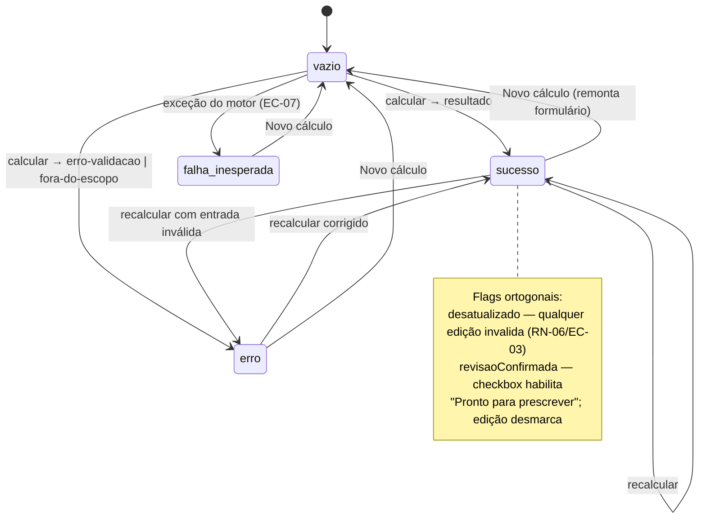
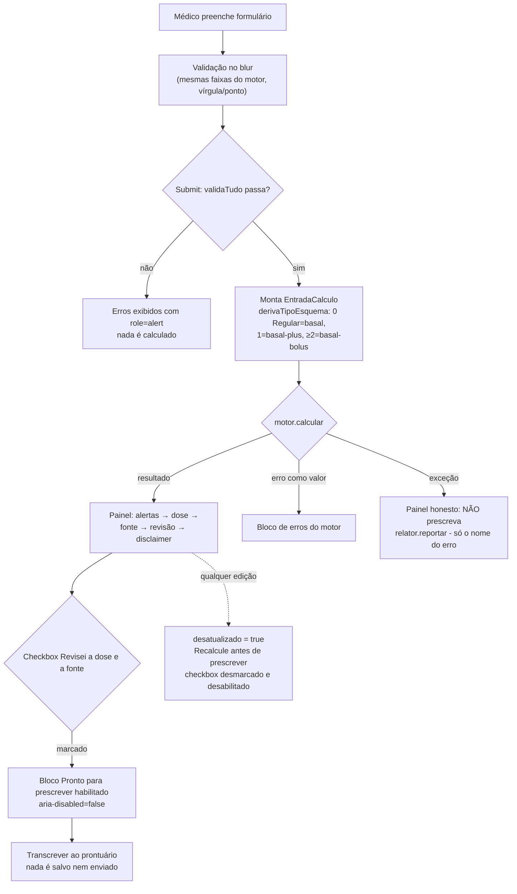
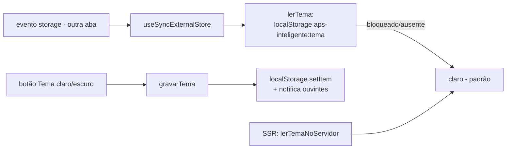

# Flowchart — módulo `interface/calculadora`

> Gerado pelo Reversa Archaeologist em 2026-07-19.

## Máquina de estados do resultado (CalculadoraApp)

## Ciclo calcular → revisar → prescrever

## Preferência de tema

