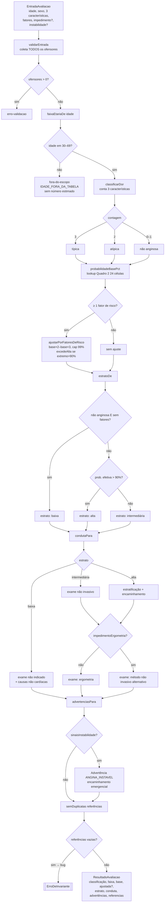

# Fluxograma — `models/cardiopatia-isquemica` (feature 010)

> Gerado pelo Archaeologist em 2026-07-23. Fachada `CalculadoraCardiopatiaIsquemica.avaliar`.

**Invariantes:** recusa honesta fora de 30–69 (sem extrapolar); estrato "baixa" pela descrição clínica, não pelo corte numérico; qualquer fator impede "baixa"; toda saída com referência.
