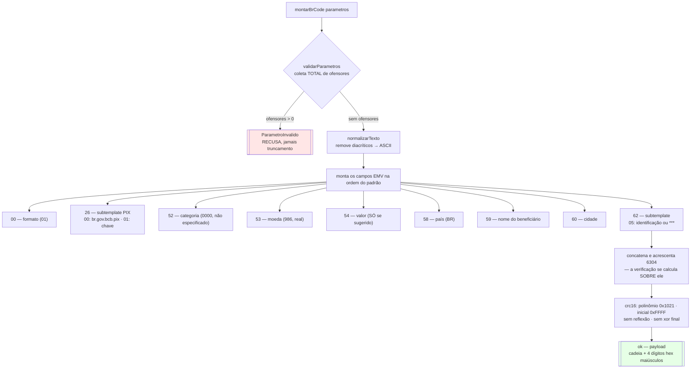
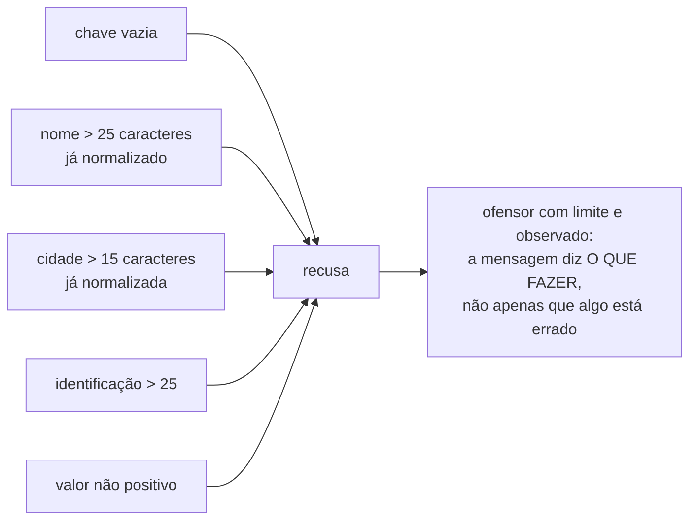
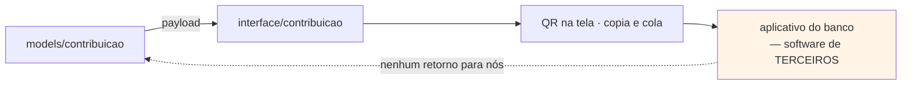
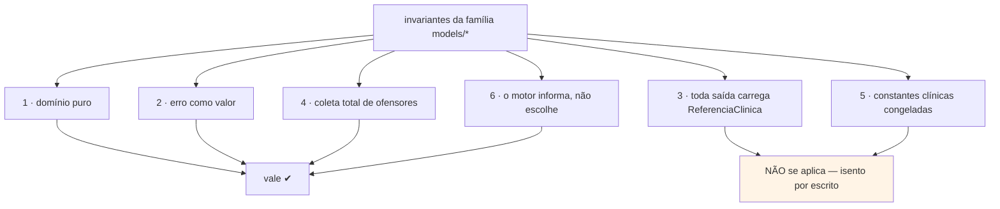

# Fluxograma — `models/contribuicao` (feature 019)

> Gerado pelo Reversa Archaeologist na re-extração nº 4 (2026-07-28).
> Fachada: `montarBrCode(parametros) → SaidaBrCode`. **Primeiro unit de domínio não clínico** da plataforma (`MD-0022`).

## Montagem do payload

> **A armadilha do CRC:** meia dúzia de variantes compartilham o polinômio `0x1021` e diferem só nos demais parâmetros, e **todas produzem quatro dígitos plausíveis**. O vetor conhecido (`"123456789"` → `29B1`) é o que distingue esta das outras.
> **A entrada inclui `6304`:** apenas os quatro dígitos do valor ficam de fora. Calcular sem esse sufixo produz código que nenhum aplicativo aceita.

## Onde a validação recusa

> Recusar em vez de truncar tem consequência concreta: nome acima do limite faz o painel **exibir erro em desenvolvimento**, e não um beneficiário errado na câmera de quem contribui.

## O contrato que a plataforma emite sem canal de erro

> Payload malformado falha **na mão de quem contribui**, sem retorno para a plataforma. Daí a verificação em duas pontas: uma automatizada contra decodificador independente, outra humana, com o consumidor real do contrato.

## Isenção declarada (`MD-0022`)

> A isenção está escrita no cabeçalho da fachada porque a re-extração confere aquela tabela linha a linha, e **ausência não declarada se lê como esquecimento, não como decisão**.
