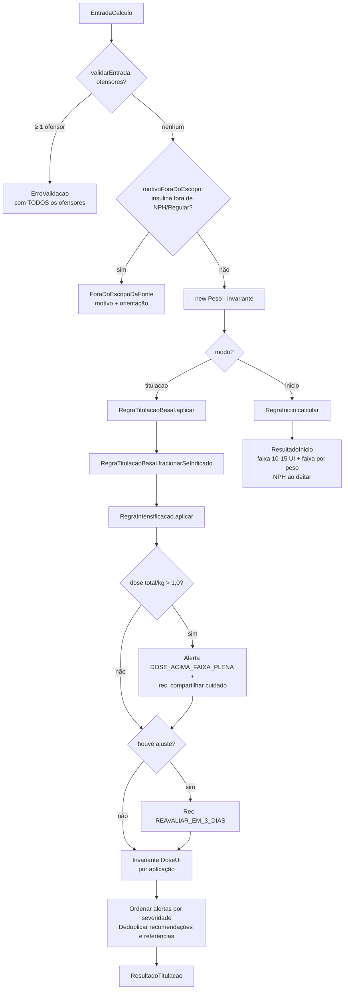
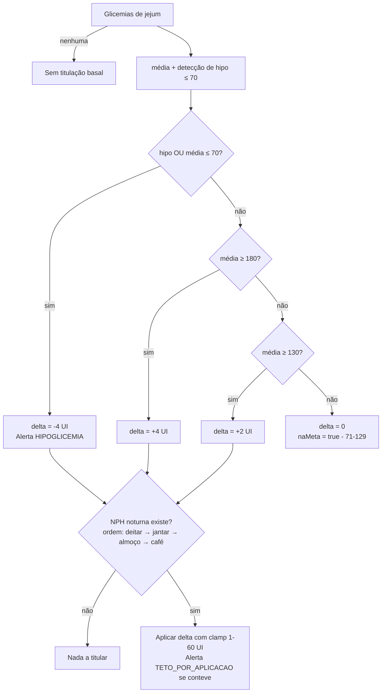
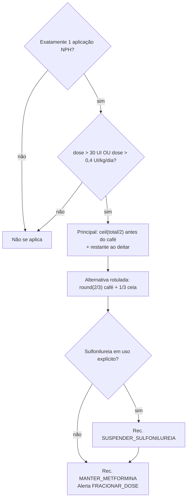
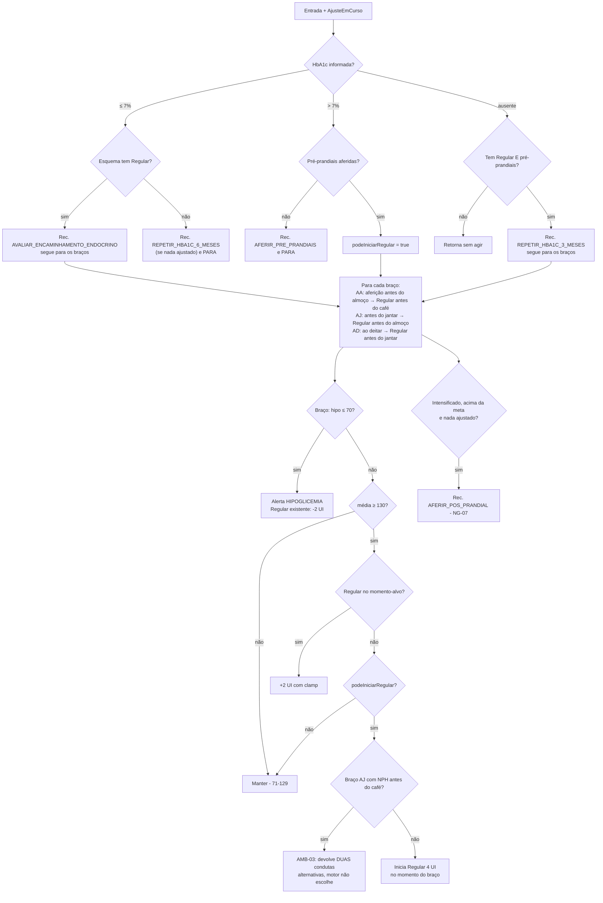

# Flowchart — módulo `models/insulina`

> Gerado pelo Reversa Archaeologist em 2026-07-19.

## Pipeline da fachada `CalculadoraInsulinaDM2.calcular`

## Titulação basal pela glicemia de jejum (R-05..R-07)

## Fracionamento da NPH (R-08..R-10, AMB-10)

## Intensificação — gate de HbA1c e braços (R-13..R-19)

