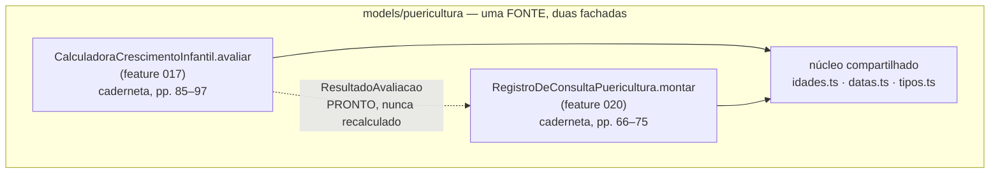
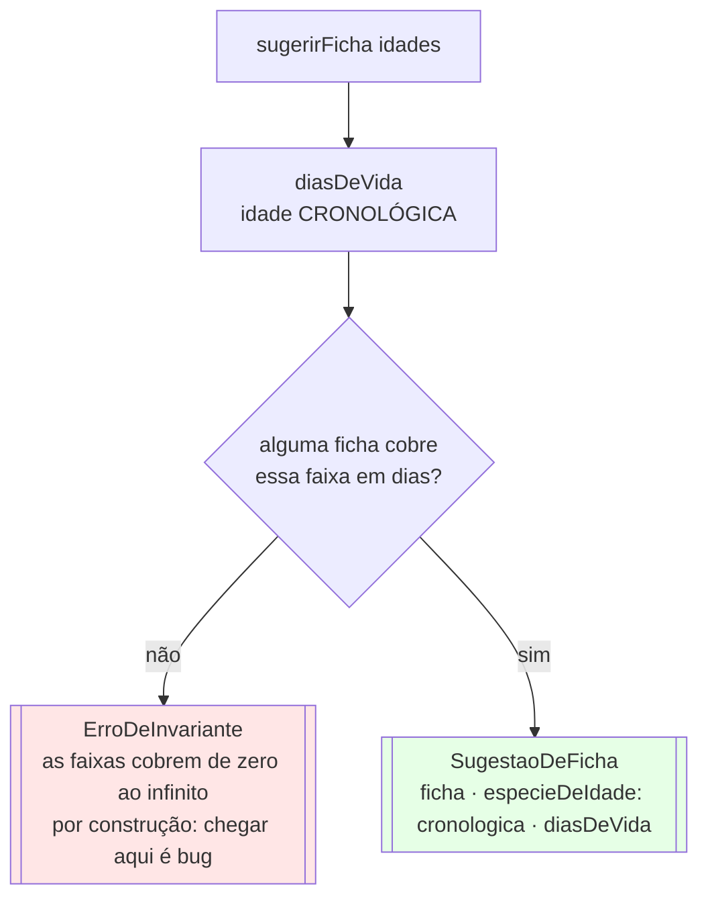
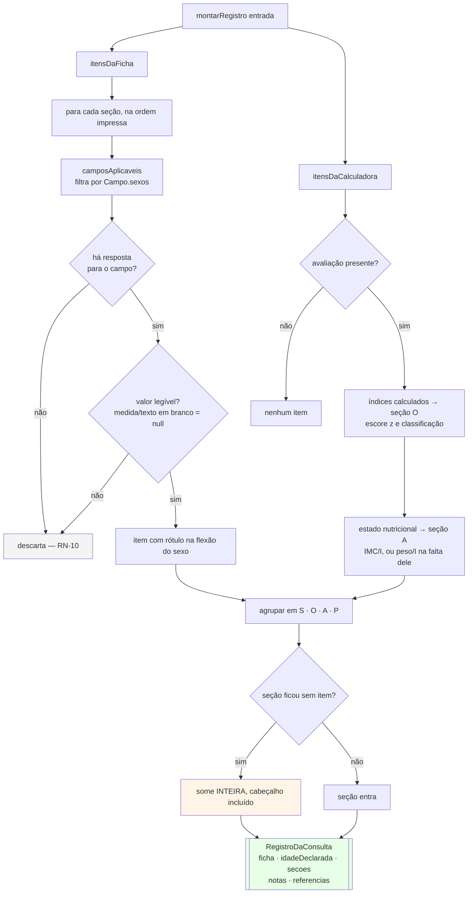

# Fluxograma — `models/puericultura/consulta` (feature 020)

> Gerado pelo Reversa Archaeologist na re-extração nº 4 (2026-07-28).
> **Segunda fachada** de `models/puericultura`: `RegistroDeConsultaPuericultura`, com `catalogo()`, `sugerir()` e `montar()`.

## Duas fachadas sob uma unit

> A ADR 0011 diz **uma fonte por unit**, e não uma fachada por unit: é a mesma caderneta, em outra seção. A alternativa examinada — uma sexta unit — exigiria importar de outra unit, sem precedente na família, ou uma terceira cópia da aritmética de datas.

## Sugestão da ficha

> **Por que a cronológica, e não a corrigida:** é ela que rege o calendário de acompanhamento e o vacinal, ao passo que a corrigida rege a leitura da curva. Não contradiz `MD-0011` — aquela ficha repartiu papéis entre *medir o corpo* e *ler a curva*, e escolher a ficha não é nenhum dos dois.
> 🟡 Idade entre duas consultas previstas cai na ficha imediatamente **anterior**: a fonte não diz o que fazer com a criança de sete meses, e o custo de errar é um clique, porque a troca é livre.

## Montagem do registro

> **A regra que governa tudo:** o registro de prontuário afirma o que foi averiguado. Cabeçalho solto afirmaria averiguação que não houve, que é pior que a omissão — é a diferença entre *não ter olhado* e *ter registrado que olhou*.
> **Onde cada coisa entra:** os escores ocupam a objetiva, que é onde a medida mora; a classificação nutricional ocupa a avaliação, porque é juízo da própria fonte, e não conclusão que este produto tenha formado.

## Uma cadeia, dois consumidores

> A identidade entre o que se vê e o que se copia passa a ser propriedade da **construção**, e não coincidência a verificar.
