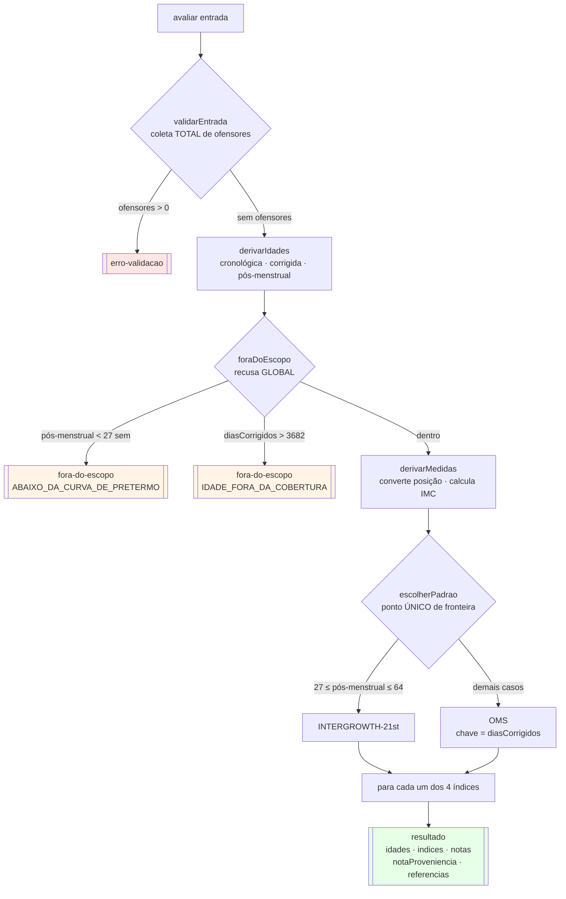
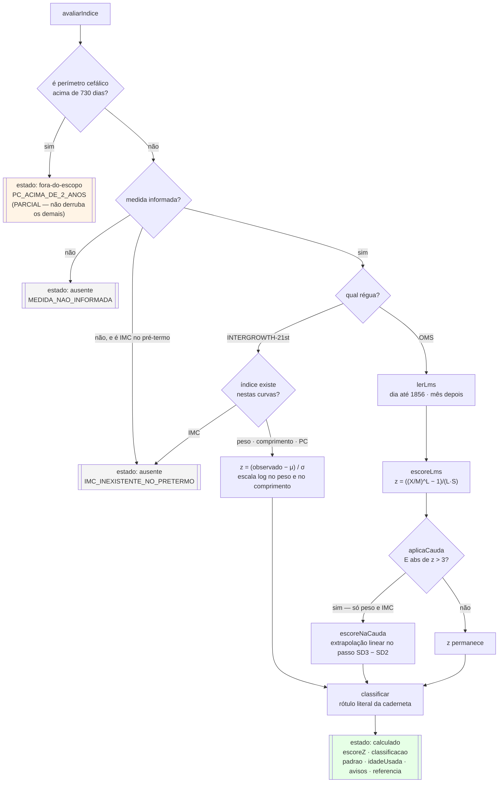
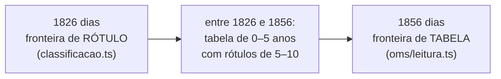
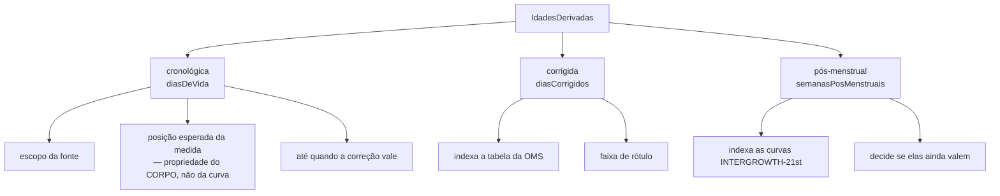

# Fluxograma — `models/puericultura` (feature 017)

> Gerado pelo Reversa Archaeologist na re-extração nº 4 (2026-07-28).
> Fachada: `CalculadoraCrescimentoInfantil.avaliar(entrada) → SaidaAvaliacao`.

## Fluxo da fachada

## Avaliação de cada índice

> A ordem dos testes não é arbitrária: **o escopo da fonte vem antes do preenchimento**. Dizer "medida não informada" numa criança de 3 anos sugeriria que o perímetro cefálico deveria ter sido informado, quando a caderneta simplesmente não o classifica nessa idade.

## As duas fronteiras dos 5 anos

> De propósito **não** coincidem. Alinhá-las produziria ora rótulo trocado, ora buraco de cobertura de 30 dias.

## Escolha da idade que governa cada coisa

