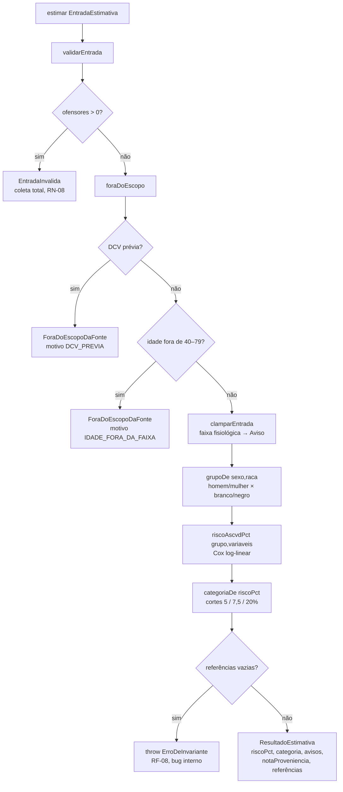
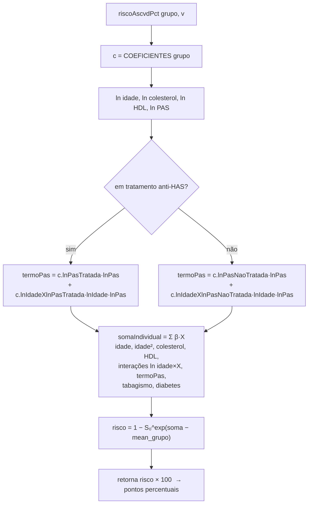

# Fluxograma — `models/risco-cardiovascular` (feature 014)

> Gerado pelo Reversa Archaeologist na re-extração nº 3 (2026-07-23).
> Fonte: 2013 ACC/AHA Guideline — Pooled Cohort Equations (Goff et al., 2014).
> Fachada: `CalculadoraRiscoCardiovascular.estimar(entrada) → SaidaEstimativa`.

## Fluxo da fachada (`calculadora.ts`)

## Núcleo da equação (`equacao.ts`)

## Dois níveis de tratamento de entrada (D-07)

- **Ofensor** (`validarEntrada`): tipo/domínio inválido — sexo/raça fora do enum, idade não-inteira ou fora de 0–120, valor não positivo. **Trava** com `EntradaInvalida` (todos os ofensores de uma vez).
- **Aviso** (`clamparEntrada`): valor numérico válido mas fora da faixa fisiológica (colesterol 130–320, HDL 20–100, PAS 90–200). **Não trava** — clampa ao limite mais próximo e sinaliza o viés ("pode subestimar/superestimar o risco").
- **Fora de escopo** (`foraDoEscopo`): idade plausível mas fora de 40–79, ou DCV prévia. **Não é erro** — é recusa honesta (`ForaDoEscopoDaFonte`), sem número estimado.
