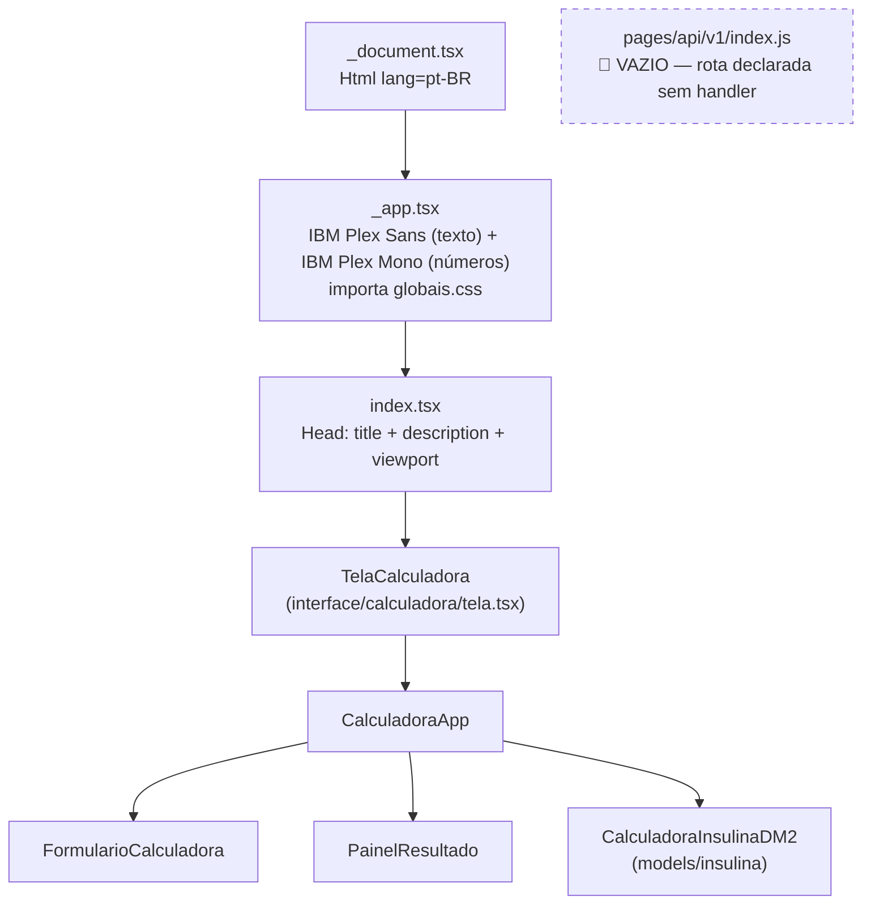

# Flowchart — módulo `pages`

> Gerado pelo Reversa Archaeologist em 2026-07-19.

## Composição do shell Next.js

```mermaid
flowchart TD
    A["_document.tsx\nHtml lang=pt-BR"] --> B["_app.tsx\nIBM Plex Sans (texto) + IBM Plex Mono (números)\nimporta globais.css"]
    B --> C["index.tsx\nHead: title + description + viewport"]
    C --> D["TelaCalculadora\n(interface/calculadora/tela.tsx)"]
    D --> E[CalculadoraApp]
    E --> F[FormularioCalculadora]
    E --> G[PainelResultado]
    E --> H["CalculadoraInsulinaDM2\n(models/insulina)"]

    X["pages/api/v1/index.js\n🔴 VAZIO — rota declarada sem handler"]:::gap
    classDef gap stroke-dasharray: 5 5
```
