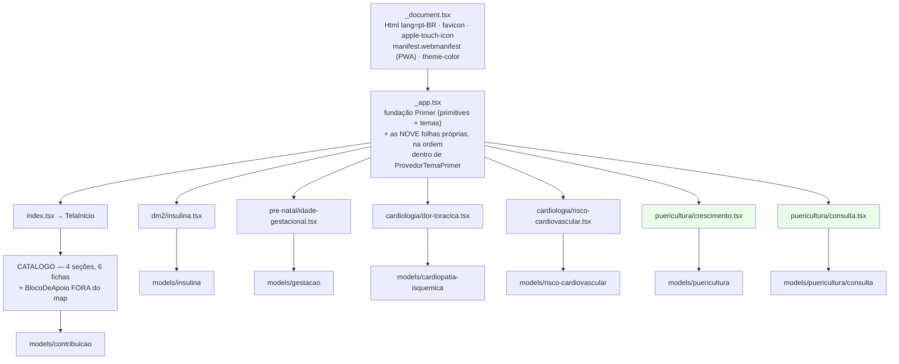
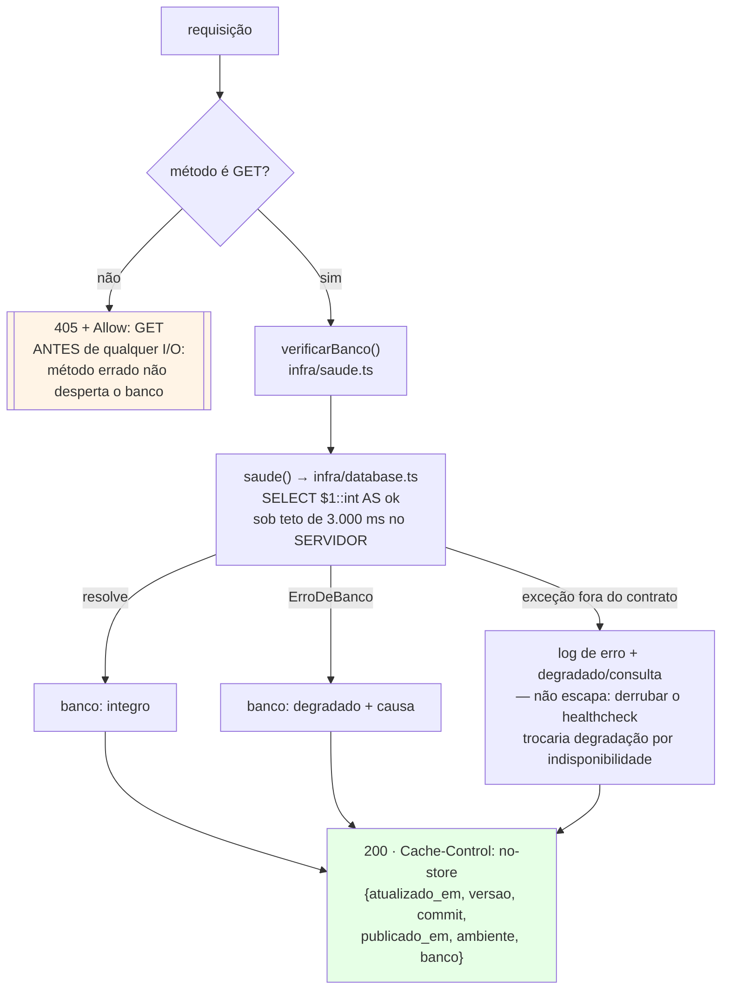
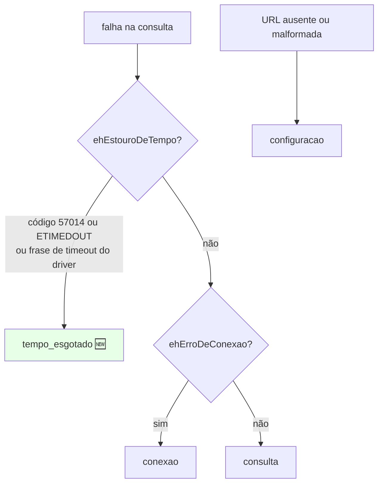

# Fluxograma — módulo `pages`

> Regenerado pelo Reversa Archaeologist na re-extração nº 4 (2026-07-28).
> Substitui a versão de 2026-07-19, que descrevia a tipografia IBM Plex (aposentada na feature 004, em favor da pilha de fontes do próprio Primer) e uma rota `pages/api/v1/index.js` vazia que **não existe mais**.

## Composição do shell

> Cada rota é uma casca `<Head>` + tela. **Toda calculadora nova entra primeiro no `CATALOGO`** — que desde a feature 018 é também oráculo da descrição da plataforma, e desde a 021 determina quais rotas a guarda geométrica percorre.

## `GET /api/v1/status` — o handler depois da feature 022

> **200 em todo estado do banco (`MD-0031`).** O código responde se a rota funcionou; o corpo responde o que ela apurou. As seis calculadoras são integralmente cliente e seguem servindo com o banco fora — um 503 afirmaria queda que não houve.

## As quatro causas de `ErroDeBanco`

> 🔴 **A ordem importa e é frágil:** `ehEstouroDeTempo` precisa vir **antes** de `ehErroDeConexao`, que casaria com o `"connection terminated"` de uma queda — outra coisa. O reconhecimento se apoia numa **frase** que o driver emite, de modo que atualização de `pg` é gatilho de revisão (watch W007 da feature 022).
> A quarta causa **retira casos** das duas existentes: instância suspensa que demora a despertar deixa de ser lida como banco fora.
