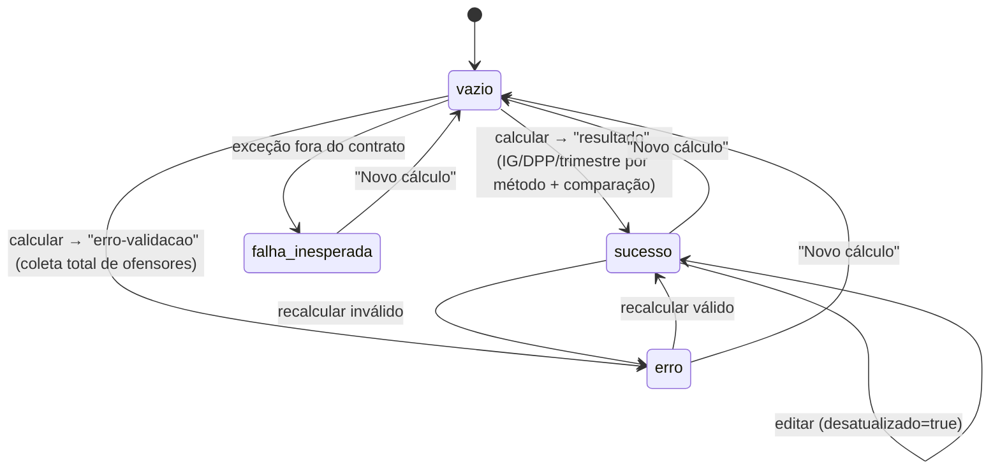
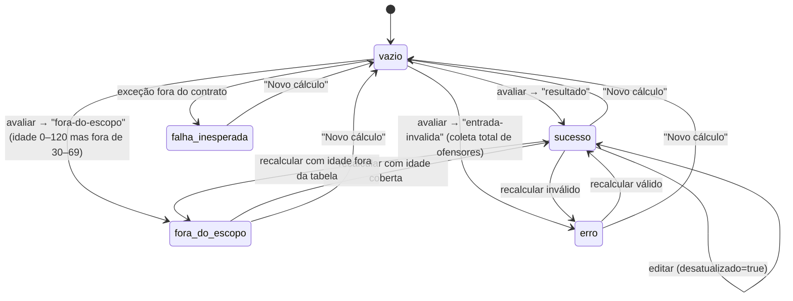
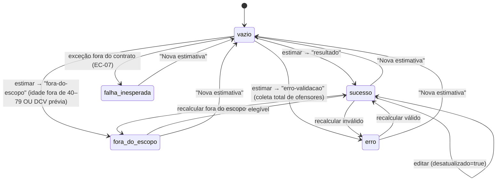
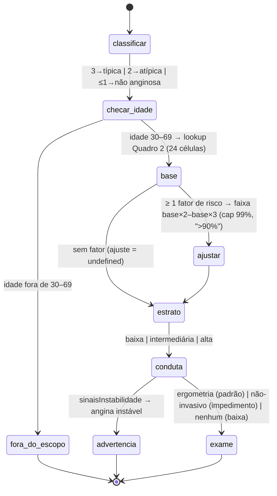
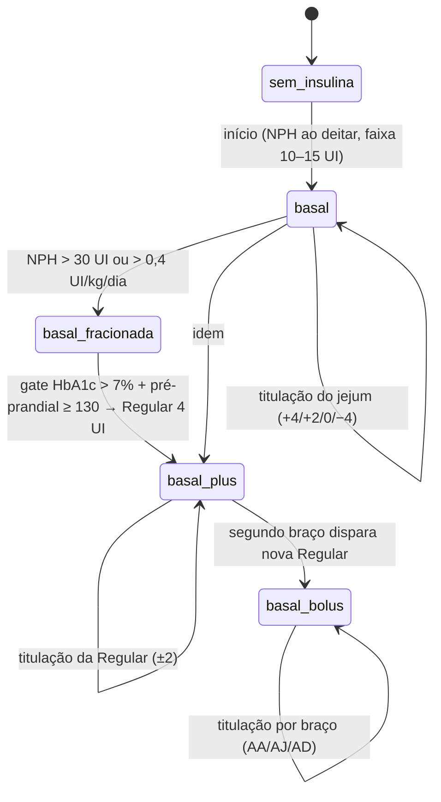

# Máquinas de Estado — aps-inteligente

> Regenerado pelo Reversa Detective em 2026-07-23 (**re-extração nº 3** — cobre as quatro telas e a cascata clínica da cardiopatia).
> Escala de confiança: 🟢 CONFIRMADO · 🟡 INFERIDO · 🔴 LACUNA

Não há entidades persistidas (sistema 100% client-side). As máquinas de estado vivem na memória da UI e, implicitamente, na progressão clínica de cada domínio. As quatro telas compartilham o mesmo **esqueleto de estado** (`vazio → sucesso | erro | falha-inesperada`), variando pelas flags e variantes que cada domínio exige — cardiopatia e risco cardiovascular acrescentam a variante `fora-do-escopo`.

## 1. `EstadoResultado` — tela da insulina (`interface/calculadora`) 🟢

Painel de resultado com duas flags ortogonais: `desatualizado` (edição invalida o resultado vigente — RN-06/EC-03) e `revisaoConfirmada` (checkbox que habilita "Pronto para prescrever" + **Copiar plano**, feature 006).

```mermaid
stateDiagram-v2
    [*] --> vazio
    vazio --> sucesso: calcular → "resultado"
    vazio --> erro: calcular → "erro-validacao" | "fora-do-escopo"
    vazio --> falha_inesperada: exceção fora do contrato (EC-07)
    sucesso --> sucesso: editar (desatualizado=true; revisão desfeita)
    sucesso --> erro: recalcular inválido
    erro --> sucesso: recalcular válido
    sucesso --> vazio: "Novo cálculo"
    erro --> vazio: "Novo cálculo"
    falha_inesperada --> vazio: "Novo cálculo"
    erro --> falha_inesperada: exceção no recálculo
    sucesso --> falha_inesperada: exceção no recálculo
```

| Estado | Significado |
|---|---|
| `vazio` | Nenhum cálculo; inicial e pós-"Novo cálculo" |
| `sucesso` | `ResultadoInicio`/`ResultadoTitulacao`; só aqui existem as flags |
| `erro` | `ErroValidacao` ou `ForaDoEscopoDaFonte` (erros como valores) |
| `falha-inesperada` | `ErroDeInvariante`/exceção desconhecida → painel honesto + evento anônimo |

🟢 **Sub-máquina da revisão** (dentro de `sucesso`): `não-confirmada → confirmada` (checkbox) e `confirmada → não-confirmada` (qualquer edição). "Pronto para prescrever" e o botão **Copiar plano** (`AcaoCopiarPlano`) só montam em `confirmada` **e não** `desatualizado`; o desmonte na invalidação zera o retorno por construção.

## 2. `EstadoIg` — tela da gestação (`interface/gestacao`) 🟢 (feature 007)

Mesmo esqueleto, **sem flag de revisão** (ADR 0012, D-08: datação não prescreve) e sem variante `fora-do-escopo` (a comparação DUM×USG resolve a divergência com um veredito interno, não com uma variante de saída).

🟢 O `veredito` da comparação (`dum-confirmada` / `dum-fora-da-margem` / `sem-parametro-na-fonte`) é conteúdo do estado `sucesso`, não um estado de UI: o motor informa a divergência dentro do resultado bem-sucedido.

## 3. `EstadoCardiologia` — tela da cardiopatia (`interface/cardiologia`) 🟢 (feature 010)

Mesmo esqueleto **sem ritual de revisão** (ADR 0012), com a variante extra `fora-do-escopo` — porque a recusa por idade fora de 30–69 (RN-06) é uma saída de primeira classe do domínio (`ForaDoEscopoDaFonte`), distinta do erro de validação.

🟢 A **advertência de angina instável** (RN-07) não é estado: é conteúdo em destaque (`Flash danger`) dentro de `sucesso`, disparado pela flag de entrada `sinaisInstabilidade`.

## 4. `EstadoRiscoCardiovascular` — tela do risco cardiovascular (`interface/risco-cardiovascular`) 🟢 (feature 014)

Idêntico ao esqueleto da cardiopatia — **sem ritual de revisão** (ADR 0012, D-08) e com a variante `fora-do-escopo`, aqui disparada por **dois** motivos distintos (idade fora de 40–79 ou DCV prévia). Molde do `AppCardiologia`.

🟢 Os **avisos de clamp fisiológico** (RN-07) não são estado: são conteúdo dentro de `sucesso` (o valor foi cortado à faixa e o risco, calculado), sinalizando o viés. A **nota de proveniência** e o `ContextoDaFonte` são conteúdo estático, presentes fora do painel de resultado em qualquer estado.

## 5. Cascata clínica da cardiopatia (`models/cardiopatia-isquemica`) 🟢

Não é máquina de estado persistida, mas um pipeline determinístico de decisão que vale documentar como fluxo — cada etapa é pura e testada por property-based (oráculo das 24 células).

🟡 **Nota descritiva do estrato** (RN-04, nota ** do Quadro 2): `"baixa"` só se a dor for **não anginosa E sem fatores de risco** — qualquer fator impede "baixa", mesmo que o número tabele baixo. É decisão descritiva, não puramente numérica, marcada 🟡 para validação (O-10-03).

## 6. Progressão clínica do esquema de insulina (`TipoEsquema`) 🟡

O domínio não modela transições explicitamente — `derivaTipoEsquema` (UI) classifica pelo número de aplicações de Regular —, mas as regras do motor implicam a progressão do guia:

🟡 `basal_fracionada` não é `TipoEsquema` próprio (continua `basal`); está no diagrama porque o fracionamento tem gatilho e conduta próprios. Transições "para trás" (retirar Regular) não existem: reduzir é o máximo da titulação (−2/−4); a desintensificação está fora do guia. 🔴 O guia não parametriza ajuste pós-prandial (NG-07) — a máquina para nos braços pré-prandiais.

## 7. Tema (`preferencia-de-tema.ts`) 🟢

Trivial e transversal às três telas: `claro ⇄ escuro`, persistido em `localStorage["aps-inteligente:tema"]`, com degradação graciosa se o storage estiver bloqueado. **Único dado durável do sistema.** Sem valor clínico.
