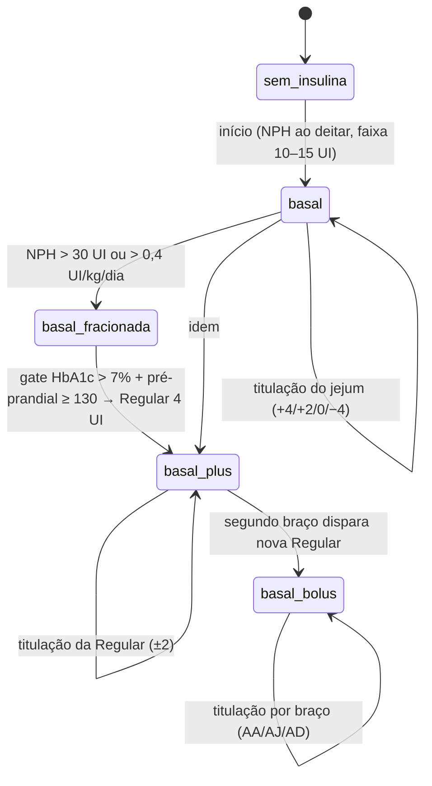

# Máquinas de Estado — aps-inteligente

> Gerado pelo Reversa Detective em 2026-07-19.
> Escala de confiança: 🟢 CONFIRMADO · 🟡 INFERIDO · 🔴 LACUNA

Não há entidades persistidas (sistema 100% client-side); as máquinas de estado vivem na memória da UI e, implicitamente, na progressão clínica do esquema de insulinização.

## 1. `EstadoResultado` (UI — `resultado.tsx` / `calculadora-app.tsx`) 🟢

Estado do painel de resultado, com duas flags ortogonais: `desatualizado` (edição no formulário invalida o resultado vigente — RN-06/EC-03) e `revisaoConfirmada` (checkbox que habilita o bloco "Pronto para prescrever").

```mermaid
stateDiagram-v2
    [*] --> vazio
    vazio --> sucesso: calcular → tipo "resultado"
    vazio --> erro: calcular → "erro-validacao" | "fora-do-escopo"
    vazio --> falha_inesperada: exceção fora do contrato (EC-07)
    sucesso --> sucesso: editar formulário (desatualizado=true; revisão desfeita)
    sucesso --> erro: recalcular com entrada inválida
    erro --> sucesso: recalcular com entrada válida
    sucesso --> vazio: "Novo cálculo" (remonta o formulário, RF-10)
    erro --> vazio: "Novo cálculo"
    falha_inesperada --> vazio: "Novo cálculo"
    erro --> falha_inesperada: exceção no recálculo
    sucesso --> falha_inesperada: exceção no recálculo
```

| Estado | Significado | Observações |
|---|---|---|
| `vazio` | Nenhum cálculo realizado | Estado inicial e pós-"Novo cálculo" |
| `sucesso` | `ResultadoInicio` ou `ResultadoTitulacao` exibido | Flags `desatualizado` e `revisaoConfirmada` só existem aqui |
| `erro` | `ErroValidacao` ou `ForaDoEscopoDaFonte` | Erros esperados, como valores |
| `falha-inesperada` | `ErroDeInvariante` ou exceção desconhecida | Painel honesto: "Não prescreva a partir desta tela"; evento anônimo ao `RelatorDeErros` |

🟢 Sub-máquina da revisão (dentro de `sucesso`): `não-confirmada → confirmada` (checkbox) e `confirmada → não-confirmada` (qualquer edição). "Pronto para prescrever" só é exibido em `confirmada` e não `desatualizado`.

## 2. Progressão clínica do esquema (`TipoEsquema`) 🟡

O domínio não modela transições explicitamente — `derivaTipoEsquema` (UI) classifica pelo número de aplicações de Regular (0 → `basal`, 1 → `basal-plus`, ≥ 2 → `basal-bolus`) —, mas as regras do motor implicam a progressão do guia:

🟡 `basal_fracionada` não é um `TipoEsquema` próprio (continua `basal`); está no diagrama porque o fracionamento tem gatilho e conduta próprios (suspender sulfonilureia, ½+½ vs. ⅔+⅔). Transições "para trás" (retirar Regular) não existem no motor: reduzir é o máximo que a titulação faz (−2/−4); a desintensificação está fora do guia. 🔴 O guia não parametriza ajuste pós-prandial (NG-07) — a máquina para nos braços pré-prandiais.

## 3. Tema (`preferencia-de-tema.ts`) 🟢

Trivial: `claro ⇄ escuro`, persistido em `localStorage["aps-inteligente:tema"]`, com degradação graciosa se o storage estiver bloqueado. Registrado por completude; sem valor clínico.
