# Máquinas de Estado — aps-inteligente

> Regenerado pelo Reversa Detective em 2026-07-28 (**re-extração nº 4** — acrescenta a tela de crescimento infantil, a ficha de consulta que **não** tem máquina de resultado, o painel de contribuição e o estado do banco visto pelo healthcheck).
> Escala de confiança: 🟢 CONFIRMADO · 🟡 INFERIDO · 🔴 LACUNA

🟢 **Não há entidade persistida**: nenhum dado clínico sai do dispositivo, e o banco não tem tabela de negócio. As máquinas vivem na memória da UI e, implicitamente, na progressão clínica de cada domínio. A novidade desta passagem é que **nem toda tela tem máquina de resultado**: a ficha de consulta deriva o seu produto continuamente, em vez de submetê-lo, e por isso troca a máquina por um cálculo. A outra novidade é que a plataforma passou a ter **um estado observável fora do navegador**, o do banco visto pelo healthcheck.

As cinco telas de cálculo compartilham o mesmo **esqueleto** (`vazio → sucesso | erro | falha-inesperada`), variando pelas flags e variantes que cada domínio exige; cardiopatia, risco cardiovascular e crescimento infantil acrescentam a variante `fora-do-escopo`.

## 1. `EstadoResultado` — tela da insulina (`interface/calculadora`) 🟢

Painel de resultado com duas flags ortogonais: `desatualizado` (edição invalida o resultado vigente) e `revisaoConfirmada` (checkbox que habilita "Pronto para prescrever" e **Copiar plano**, feature 006).

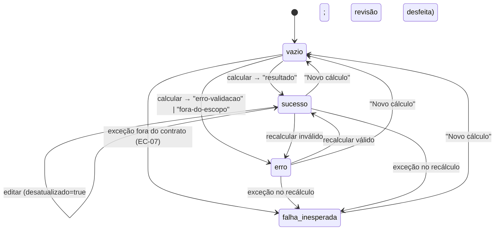
```mermaid
stateDiagram-v2
    [*] --> vazio
    vazio --> sucesso: calcular → "resultado"
    vazio --> erro: calcular → "erro-validacao" | "fora-do-escopo"
    vazio --> falha_inesperada: exceção fora do contrato (EC-07)
    sucesso --> sucesso: editar (desatualizado=true; revisão desfeita)
    sucesso --> erro: recalcular inválido
    erro --> sucesso: recalcular válido
    sucesso --> vazio: "Novo cálculo"
    erro --> vazio: "Novo cálculo"
    falha_inesperada --> vazio: "Novo cálculo"
    erro --> falha_inesperada: exceção no recálculo
    sucesso --> falha_inesperada: exceção no recálculo
```

| Estado | Significado |
|---|---|
| `vazio` | Nenhum cálculo; inicial e pós-"Novo cálculo" |
| `sucesso` | `ResultadoInicio`/`ResultadoTitulacao`; só aqui existem as flags |
| `erro` | `ErroValidacao` ou `ForaDoEscopoDaFonte` (erros como valores) |
| `falha-inesperada` | `ErroDeInvariante`/exceção desconhecida → painel honesto + evento anônimo |

🟢 **Sub-máquina da revisão** (dentro de `sucesso`): `não-confirmada → confirmada` pelo checkbox, e `confirmada → não-confirmada` a qualquer edição. "Pronto para prescrever" e **Copiar plano** só montam em `confirmada` **e não** `desatualizado`; o desmonte na invalidação zera o retorno por construção.

## 2. `EstadoIg` — tela da gestação (`interface/gestacao`) 🟢 (feature 007)

Mesmo esqueleto, **sem flag de revisão** (ADR 0012) e sem variante `fora-do-escopo`: a comparação DUM×USG resolve a divergência com um veredito interno, e não com uma variante de saída.

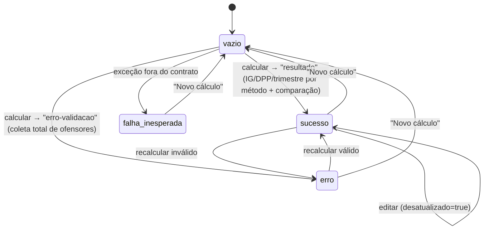
```mermaid
stateDiagram-v2
    [*] --> vazio
    vazio --> sucesso: calcular → "resultado" (IG/DPP/trimestre por método + comparação)
    vazio --> erro: calcular → "erro-validacao" (coleta total de ofensores)
    vazio --> falha_inesperada: exceção fora do contrato
    sucesso --> sucesso: editar (desatualizado=true)
    sucesso --> erro: recalcular inválido
    erro --> sucesso: recalcular válido
    sucesso --> vazio: "Novo cálculo"
    erro --> vazio: "Novo cálculo"
    falha_inesperada --> vazio: "Novo cálculo"
```

🟢 O `veredito` (`dum-confirmada` / `dum-fora-da-margem` / `sem-parametro-na-fonte`) é conteúdo do estado `sucesso`, não estado de UI: o motor informa a divergência dentro do resultado bem-sucedido.

## 3. `EstadoCardiologia` — tela da cardiopatia (`interface/cardiologia`) 🟢 (feature 010)

Mesmo esqueleto sem ritual de revisão, com a variante extra `fora-do-escopo`, porque a recusa por idade fora de 30–69 é saída de primeira classe do domínio.

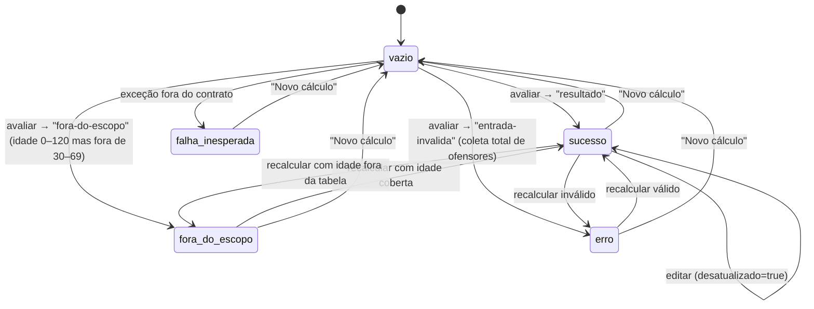
```mermaid
stateDiagram-v2
    [*] --> vazio
    vazio --> sucesso: avaliar → "resultado"
    vazio --> fora_do_escopo: avaliar → "fora-do-escopo" (idade 0–120 mas fora de 30–69)
    vazio --> erro: avaliar → "entrada-invalida" (coleta total de ofensores)
    vazio --> falha_inesperada: exceção fora do contrato
    sucesso --> sucesso: editar (desatualizado=true)
    fora_do_escopo --> sucesso: recalcular com idade coberta
    sucesso --> fora_do_escopo: recalcular com idade fora da tabela
    sucesso --> erro: recalcular inválido
    erro --> sucesso: recalcular válido
    sucesso --> vazio: "Novo cálculo"
    fora_do_escopo --> vazio: "Novo cálculo"
    erro --> vazio: "Novo cálculo"
    falha_inesperada --> vazio: "Novo cálculo"
```

🟢 A **advertência de angina instável** não é estado: é conteúdo em destaque (`Flash danger`) dentro de `sucesso`, disparado pela flag de entrada `sinaisInstabilidade`.

## 4. `EstadoRiscoCardiovascular` — tela do risco cardiovascular 🟢 (feature 014)

Idêntico ao esqueleto da cardiopatia, com a variante `fora-do-escopo` disparada por **dois** motivos distintos (idade fora de 40–79 ou DCV prévia).

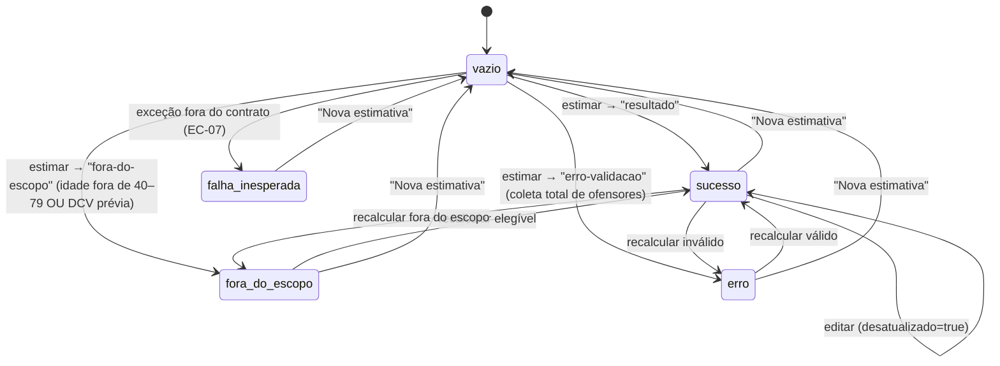
```mermaid
stateDiagram-v2
    [*] --> vazio
    vazio --> sucesso: estimar → "resultado"
    vazio --> fora_do_escopo: estimar → "fora-do-escopo" (idade fora de 40–79 OU DCV prévia)
    vazio --> erro: estimar → "erro-validacao" (coleta total de ofensores)
    vazio --> falha_inesperada: exceção fora do contrato (EC-07)
    sucesso --> sucesso: editar (desatualizado=true)
    fora_do_escopo --> sucesso: recalcular elegível
    sucesso --> fora_do_escopo: recalcular fora do escopo
    sucesso --> erro: recalcular inválido
    erro --> sucesso: recalcular válido
    sucesso --> vazio: "Nova estimativa"
    fora_do_escopo --> vazio: "Nova estimativa"
    erro --> vazio: "Nova estimativa"
    falha_inesperada --> vazio: "Nova estimativa"
```

🟢 Os **avisos de clamp fisiológico** não são estado: são conteúdo dentro de `sucesso`, sinalizando o viés do corte. A nota de proveniência e o `ContextoDaFonte` são conteúdo estático, presentes em qualquer estado.

## 5. 🆕 `EstadoCrescimento` — tela do crescimento infantil (`interface/puericultura`) 🟢 (feature 017)

Quinto uso do mesmo esqueleto, com a variante `fora-do-escopo` no molde da cardiopatia. Sem ritual de revisão: avaliar crescimento não prescreve dose.

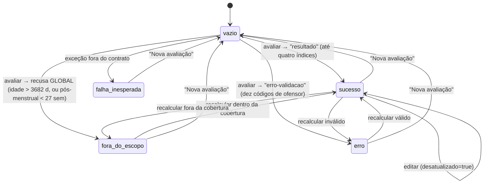
```mermaid
stateDiagram-v2
    [*] --> vazio
    vazio --> sucesso: avaliar → "resultado" (até quatro índices)
    vazio --> fora_do_escopo: avaliar → recusa GLOBAL (idade > 3682 d, ou pós-menstrual < 27 sem)
    vazio --> erro: avaliar → "erro-validacao" (dez códigos de ofensor)
    vazio --> falha_inesperada: exceção fora do contrato
    sucesso --> sucesso: editar (desatualizado=true)
    fora_do_escopo --> sucesso: recalcular dentro da cobertura
    sucesso --> fora_do_escopo: recalcular fora da cobertura
    sucesso --> erro: recalcular inválido
    erro --> sucesso: recalcular válido
    sucesso --> vazio: "Nova avaliação"
    fora_do_escopo --> vazio: "Nova avaliação"
    erro --> vazio: "Nova avaliação"
    falha_inesperada --> vazio: "Nova avaliação"
```

🟢 **A recusa parcial não é estado, e é justamente isso que a torna útil.** O perímetro cefálico acima de 730 dias devolve a variante de **índice** fora de escopo, dentro de um resultado bem-sucedido: os outros três índices seguem calculados e exibidos. Só a recusa **global** move a tela para `fora-do-escopo`.

🟢 Também são conteúdo de `sucesso`, e não estados: o **aviso de conversão de posição** (que acompanha estatura e IMC ao mesmo tempo), a **premissa declarada de termo** quando a IG ao nascer não foi informada, e a **régua usada** em cada índice.

## 6. 🆕 A ficha de consulta (`interface/puericultura/consulta`) 🟢 (feature 020) — a tela sem máquina de resultado

🟢 **Esta tela não tem `Estado*`, e a ausência é decisão.** As cinco anteriores submetem um formulário e guardam o que voltou; aqui a edição **é** o preenchimento, de modo que um estado `vazio → sucesso` marcaria como evento o que é o trabalho normal, e uma flag `desatualizado` acusaria como defeito o comportamento esperado. Em lugar da máquina, um `useMemo` deriva o registro a cada tecla, e a mesma cadeia alimenta o `<pre>` que exibe e o comando que copia.

O que existe de estado é a coleção de entradas do preenchimento, mais três chaves de controle:

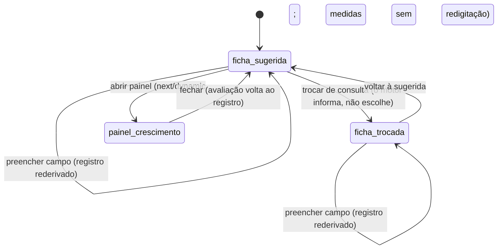
```mermaid
stateDiagram-v2
    [*] --> ficha_sugerida
    ficha_sugerida --> ficha_sugerida: preencher campo (registro rederivado)
    ficha_sugerida --> ficha_trocada: trocar de consulta (o motor informa, não escolhe)
    ficha_trocada --> ficha_trocada: preencher campo (registro rederivado)
    ficha_trocada --> ficha_sugerida: voltar à sugerida
    ficha_sugerida --> painel_crescimento: abrir painel (next/dynamic; medidas sem redigitação)
    painel_crescimento --> ficha_sugerida: fechar (avaliação volta ao registro)
```

| Chave | Papel |
|---|---|
| `preenchimento` | As respostas por campo; a fonte do registro derivado |
| `fichaTrocada` | `null` enquanto vale a sugestão pela idade cronológica; a ficha escolhida à mão quando o prescritor troca |
| `painelAberto` | O painel de crescimento, montado por `next/dynamic` para que quem não o abre não pague as tabelas antropométricas |
| `avaliacao` | O `ResultadoAvaliacao` que volta do painel e é **transposto** ao registro, jamais recalculado |

🟢 **A montagem do registro é que tem regra de estado, não a tela:** campo sem resposta não entra, e seção que fique sem item **some inteira, cabeçalho incluído**. O registro é, portanto, uma função total do preenchimento: não há estado intermediário em que a tela mostre uma coisa e a área de transferência entregue outra.

## 7. 🆕 Painel de contribuição (`interface/contribuicao`) 🟢 (feature 019)

Máquina trivial e sem consequência clínica, registrada por completude e porque a sua **falta** de efeitos é verificada: abrir e fechar não faz requisição, não busca dado e não cria durável novo.

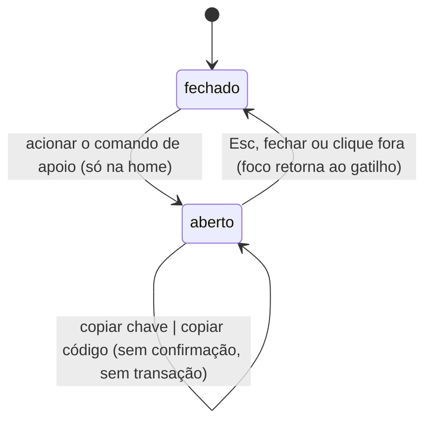
```mermaid
stateDiagram-v2
    [*] --> fechado
    fechado --> aberto: acionar o comando de apoio (só na home)
    aberto --> fechado: Esc, fechar ou clique fora (foco retorna ao gatilho)
    aberto --> aberto: copiar chave | copiar código (sem confirmação, sem transação)
```

🟢 O `Dialog` do Primer prende o foco e o devolve ao gatilho. Os dois comandos de cópia vêm **antes** do QR no DOM, porque quem abre a plataforma no próprio celular não tem como apontar a câmera do aparelho para a tela dele: copiar é o caminho principal, não a conveniência secundária.

## 8. 🆕 Estado do banco visto pelo healthcheck (`infra/saude.ts`) 🟢 (feature 022)

🟢 **A primeira máquina do sistema que descreve algo fora do navegador.** `verificarBanco` traduz o desfecho da consulta `SELECT $1::int AS ok` em valor, e nunca lança: a exceção que não for `ErroDeBanco` é bug do contrato interno, cai no balde `consulta` e faz barulho no log, porque derrubar o healthcheck trocaria degradação por indisponibilidade.

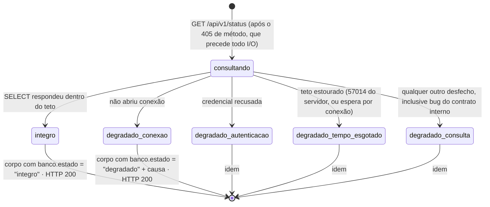
```mermaid
stateDiagram-v2
    [*] --> consultando: GET /api/v1/status (após o 405 de método, que precede todo I/O)
    consultando --> integro: SELECT respondeu dentro do teto
    consultando --> degradado_conexao: não abriu conexão
    consultando --> degradado_autenticacao: credencial recusada
    consultando --> degradado_tempo_esgotado: teto estourado (57014 do servidor, ou espera por conexão)
    consultando --> degradado_consulta: qualquer outro desfecho, inclusive bug do contrato interno
    integro --> [*]: corpo com banco.estado = "integro" · HTTP 200
    degradado_conexao --> [*]: corpo com banco.estado = "degradado" + causa · HTTP 200
    degradado_autenticacao --> [*]: idem
    degradado_tempo_esgotado --> [*]: idem
    degradado_consulta --> [*]: idem
```

🟢 **O código HTTP é 200 em todo estado do banco** (`MD-0031`, ADR 0020). As seis calculadoras são integralmente cliente e seguem servindo com a dependência caída, de modo que um 503 afirmaria uma queda que não houve. O código responde se a rota funcionou; o corpo responde o que ela apurou.

🟢 **A quarta causa `tempo_esgotado` retira casos das outras duas:** o cancelamento pelo servidor (`57014`) deixa de cair em `consulta`, e o estouro na espera por conexão deixa de cair em `conexao`. Instância suspensa que demora a despertar deixa de ser lida como banco fora.

🔴 A transição para `degradado_tempo_esgotado` no ramo da conexão é reconhecida por uma **frase** que o driver emite, e precisa ser testada antes do erro de conexão, que casaria com o prefixo comum. Atualização de `pg` é gatilho de revisão (watch W007).

## 9. Cascata clínica da cardiopatia (`models/cardiopatia-isquemica`) 🟢

Pipeline determinístico de decisão, cada etapa pura e coberta pelo oráculo das 24 células.

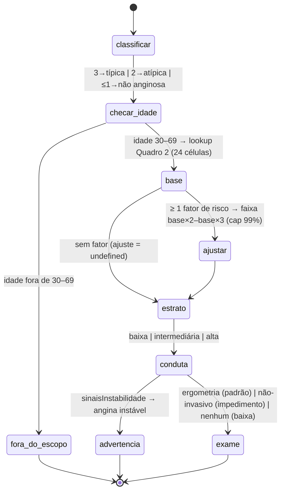
```mermaid
stateDiagram-v2
    [*] --> classificar
    classificar --> checar_idade: 3→típica | 2→atípica | ≤1→não anginosa
    checar_idade --> fora_do_escopo: idade fora de 30–69
    checar_idade --> base: idade 30–69 → lookup Quadro 2 (24 células)
    base --> ajustar: ≥ 1 fator de risco → faixa base×2–base×3 (cap 99%)
    base --> estrato: sem fator (ajuste = undefined)
    ajustar --> estrato
    estrato --> conduta: baixa | intermediária | alta
    conduta --> exame: ergometria (padrão) | não-invasivo (impedimento) | nenhum (baixa)
    conduta --> advertencia: sinaisInstabilidade → angina instável
    fora_do_escopo --> [*]
    advertencia --> [*]
    exame --> [*]
```

🟡 **Nota descritiva do estrato:** `"baixa"` só se a dor for não anginosa **e** sem fatores de risco. Decisão descritiva, não puramente numérica, marcada para validação (O-10-03).

## 10. 🆕 Cascata do crescimento infantil (`models/puericultura`) 🟢

A cascata mais ramificada da plataforma, e a única em que uma etapa pode recusar **parte** da saída sem derrubar o resto.

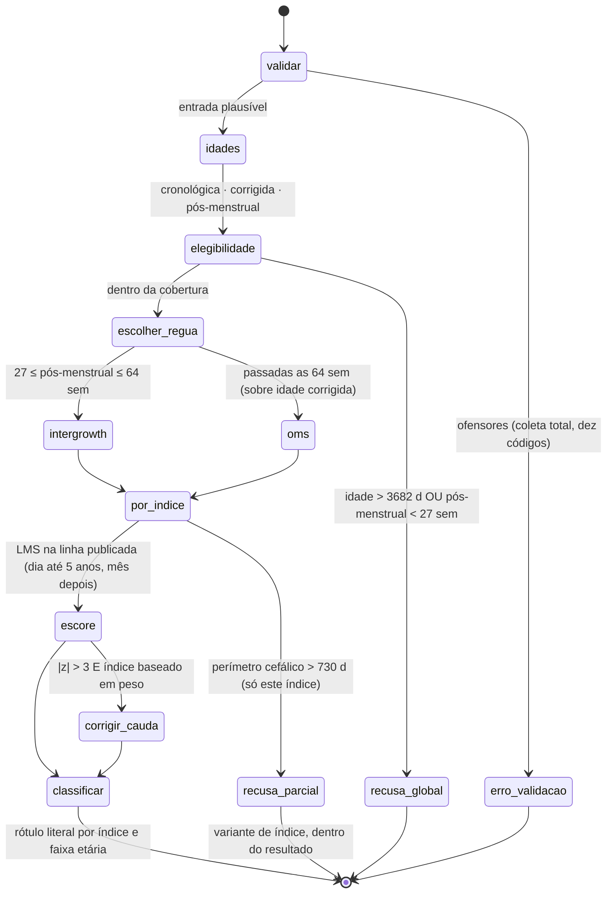
```mermaid
stateDiagram-v2
    [*] --> validar
    validar --> erro_validacao: ofensores (coleta total, dez códigos)
    validar --> idades: entrada plausível
    idades --> elegibilidade: cronológica · corrigida · pós-menstrual
    elegibilidade --> recusa_global: idade > 3682 d OU pós-menstrual < 27 sem
    elegibilidade --> escolher_regua: dentro da cobertura
    escolher_regua --> intergrowth: 27 ≤ pós-menstrual ≤ 64 sem
    escolher_regua --> oms: passadas as 64 sem (sobre idade corrigida)
    intergrowth --> por_indice
    oms --> por_indice
    por_indice --> recusa_parcial: perímetro cefálico > 730 d (só este índice)
    por_indice --> escore: LMS na linha publicada (dia até 5 anos, mês depois)
    escore --> corrigir_cauda: |z| > 3 E índice baseado em peso
    escore --> classificar
    corrigir_cauda --> classificar
    classificar --> [*]: rótulo literal por índice e faixa etária
    recusa_parcial --> [*]: variante de índice, dentro do resultado
    recusa_global --> [*]
    erro_validacao --> [*]
```

🟢 **A régua se escolhe uma vez, por criança, e não por índice** (D-01): a etapa `escolher_regua` precede o laço dos índices exatamente para tornar isso impossível de violar por descuido.

🟢 **`por_indice` atravessa as duas fronteiras que não coincidem:** a de tabela (1.856 dias) governa qual acervo se lê, e a de rótulo (1.826) governa qual conjunto de cortes se aplica. Entre uma e outra vale a tabela de 0–5 anos com os rótulos de 5–10, e é assim de propósito.

## 11. 🆕 Seleção da ficha de consulta (`models/puericultura/consulta`) 🟢

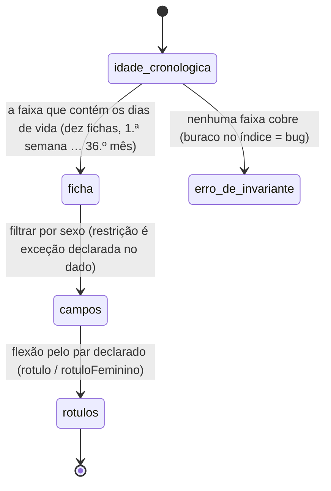
```mermaid
stateDiagram-v2
    [*] --> idade_cronologica
    idade_cronologica --> ficha: a faixa que contém os dias de vida (dez fichas, 1.ª semana … 36.º mês)
    idade_cronologica --> erro_de_invariante: nenhuma faixa cobre (buraco no índice = bug)
    ficha --> campos: filtrar por sexo (restrição é exceção declarada no dado)
    campos --> rotulos: flexão pelo par declarado (rotulo / rotuloFeminino)
    rotulos --> [*]
```

🟡 Idade entre duas consultas previstas cai na ficha imediatamente **anterior**, premissa registrada porque a fonte não diz o que fazer com a criança de sete meses. O prescritor troca com um clique, e a troca é livre por desenho.

## 12. Progressão clínica do esquema de insulina (`TipoEsquema`) 🟡

O domínio não modela transições explicitamente, mas as regras do motor implicam a progressão do guia.

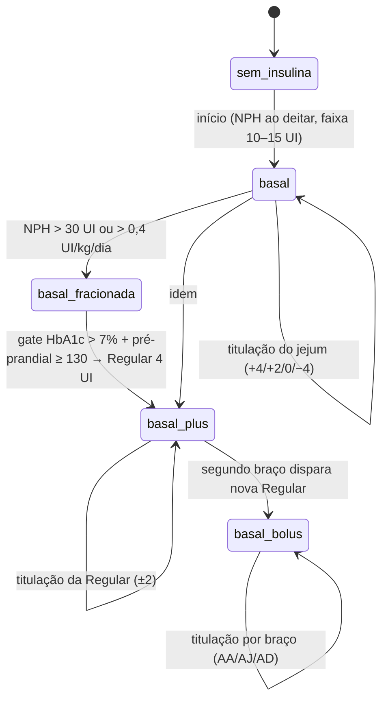
```mermaid
stateDiagram-v2
    [*] --> sem_insulina
    sem_insulina --> basal: início (NPH ao deitar, faixa 10–15 UI)
    basal --> basal: titulação do jejum (+4/+2/0/−4)
    basal --> basal_fracionada: NPH > 30 UI ou > 0,4 UI/kg/dia
    basal_fracionada --> basal_plus: gate HbA1c > 7% + pré-prandial ≥ 130 → Regular 4 UI
    basal --> basal_plus: idem
    basal_plus --> basal_bolus: segundo braço dispara nova Regular
    basal_plus --> basal_plus: titulação da Regular (±2)
    basal_bolus --> basal_bolus: titulação por braço (AA/AJ/AD)
```

🟡 `basal_fracionada` não é `TipoEsquema` próprio; está no diagrama porque o fracionamento tem gatilho e conduta próprios. Transições "para trás" não existem: reduzir é o máximo da titulação, e a desintensificação está fora do guia. 🔴 O guia não parametriza ajuste pós-prandial, e a máquina para nos braços pré-prandiais.

## 13. Tema (`preferencia-de-tema.ts`) 🟢

Trivial e transversal às sete rotas de página: `claro ⇄ escuro`, persistido em `localStorage["aps-inteligente:tema"]`, com degradação graciosa se o storage estiver bloqueado. **Único dado durável do sistema.** Sem valor clínico. O alternador exibe o tema-**alvo**, e não o vigente.
